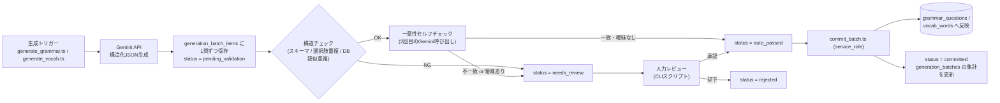

# TOEIC学習アプリ 設計ドキュメント

このファイルはプロジェクトの設計決定事項を記録する。機能追加・仕様変更のたびに追記していく運用とする。

---

## 更新履歴

- 2026-08-08: 初版作成。ディレクトリ構成・DBスキーマ（FSRS版）・ER図・RLSポリシーを確定。
- 2026-08-08: Gemini APIバッチ生成パイプライン（プロンプトテンプレート・自動検証・人力レビュー・本番反映フロー）を確定。
- 2026-08-08: フロントエンド設計（技術スタック・認証方式・ルーティング・FSRS統合方針）を確定。
- 2026-08-13: モバイル表示（390×844、iPhone 12/13相当）の確認を実施。主要9画面（Home/VocabReview/GrammarDrill/WeakPoints/VocabTagList/MixedDrill/Login/GrammarCategories/AuthCallback）を、各画面の主要な状態（未回答/回答済み、空状態/データありなど）まで含めて確認したが、崩れは1件も見つからず修正不要だった。特に懸念していた`VocabReview`の4択評価ボタン（`grid-cols-4`固定）と、`WeakPoints`の`StatRow`（ラベル+バッジを左・ゲージ+正答率+件数を右に配置する`justify-between`レイアウト、最長のカテゴリ名「不定詞・動名詞」でも確認）はいずれも折り返し・はみ出し無く収まった。単一カラム・`flex`/`gap`ベースの余白設計（固定px幅を極力使わない）が功を奏している。
- 2026-08-13: キーボード操作の完結性を見直し、GrammarDrill/MixedDrill/VocabReviewの3画面で見つかった断絶を修正。
  - **セッション完了画面でEnterキーが効かなくなっていた不具合**（3画面共通）: 各画面のグローバルkeydownハンドラは「現在の設問/カード」が`undefined`（配列範囲外）だと即returnする作りだったため、セッション完了画面（＝設問/カードが尽きた状態）ではEnterが一切反応しなくなっていた。`isSessionComplete`を明示的に判定し、その場合はEnterで主要リンクへ`navigate()`するよう修正（GrammarDrillは「カテゴリ一覧に戻る」、MixedDrillは「ホームに戻る」、VocabReviewは`backLabel`＝文脈に応じて「ホームに戻る」または「弱点分析ダッシュボードに戻る」）。各完了画面に「Enter: ◯◯に戻る」のヒント文言も追加。
  - **VocabReviewの「答えを見る」にキーボード操作が無かった不具合**: 依頼内容には無かったが、一連の流れをキーボードのみで通しで確認する過程で発見。答えを見る前はEnterキーで反応しないため、キーボードのみのユーザーがここで詰まっていた。Enterで`handleReveal()`を実行するよう追加し、下部ヒントも状態に応じて「Enter: 答えを見る」⇔「1〜4: 評価」を出し分けるようにした。評価後の自動遷移（`useMutation`の`onSuccess`で`advance()`）は既存実装のとおり正しく機能していることを確認済み（変更なし）。
  - **AskTutorPanel（もっと詳しく聞く）とのEnterキー競合**: パネルの`<textarea>`にフォーカスがある状態でEnterを押すと、改行が入るのと同時に親画面のグローバルkeydownハンドラにもイベントが伝播し、意図せず「次の問題へ」が発火してしまう不具合を確認。修正: textareaにEnter(Shiftなし)＝質問送信・Shift+Enter＝改行という専用ハンドラを追加し、パネルのルート要素（閉じたボタン状態・展開後のコンテナ双方）に`onKeyDown={(e) => e.stopPropagation()}`を付与して、パネル内でのキー入力が親のwindowリスナーに一切伝播しないようにした。調査の過程で、依頼内容を超えてもう1つの実害を発見: VocabReviewは評価ボタンが表示されている間（＝パネルも同時に表示されうる間）1〜4キーが生きているため、質問文に数字を含めて入力すると（例:「なぜ2ではダメ？」）誤って評価が送信されてしまう状態だった。stopPropagationの対象をEnterに限定せずキー入力全般にしたことで、この経路もあわせて解消した。
  - **動作確認（依頼の4番）**: ブラウザ拡張が本セッションでは接続できず、実ブラウザでのライブ確認は実施できなかった（正直に申告）。代わりに、実際のDOM keydownイベント・実際のルーター遷移を伴う自動テストで同等のキーボードのみフロー（問題を見る→回答→Enterで次へ→…→セッション完了→Enterで遷移、VocabReviewは答えを見る→評価→自動遷移→セッション完了→Enterで遷移）を新規に追加して検証した。
  - テスト: `npm test`（195件全て成功、187件から+8件——GrammarDrill/MixedDrillに各1件、VocabReviewに3件、AskTutorPanelに4件追加の計8件）・`npm run lint`（0件）・`npm run typecheck`（0件）。
- 2026-08-11: AskTutorPanelの改善2件。まず動作確認の過程で、直前のEnterキー競合修正が未コミットのままだったため`dist/`が古いビルドのままで、本番ビルド(`npm run build`)では旧不具合が再現する状態だったことが判明（デプロイ設定は無く`npm run preview`でのローカル配信のみのプロジェクトのため、再ビルドのみで解消）。その上で以下を追加実装。
  - **「もっと詳しく聞く」ボタンへのキーボードショートカット割り当て**: パネルが閉じている間だけ`"?"`キーでパネルを開けるようにし（開いた後は`useEffect`でリスナーを外し、質問文に`?`を打てるようにする）、閉じたボタンのラベル横に`?`のヒントを表示（`CHOICE_LABELS`/`RATING_KEY_HINTS`と同じ、キーヒントをボタン横に添えるパターンを踏襲）。開いた瞬間に`textarea`へ自動フォーカスする。
  - **定型質問のスニペットボタン**: テキストエリア上部に、クリックで質問文を差し込める定型文ボタンを追加（「なぜこの答えが正しいのですか?」「もっと詳しく教えてください」は常設、「他の選択肢ではなぜダメなのですか?」は`choices`が渡されている設問（GrammarDrill/MixedDrill）でのみ表示——VocabReview（選択肢の概念が無い）では出さない）。
  - **質問入力中のショートカットヒント切り替え**: `AskTutorPanel`に`onFocusChange`コールバックを追加し、テキストエリアの`onFocus`/`onBlur`で親に通知。GrammarDrill/MixedDrill/VocabReviewはこれを`isAskingTutor`状態として受け取り、画面下部のヒント文言を「1〜4: 選択 / Enter: 次へ」等から「Enter: 質問を送信 / Shift+Enter: 改行」に切り替える。状態のリセットは明示的なリセット処理を持たず、テキストエリアのフォーカスが外れる（＝ボタンクリックで次へ進む際は自然にblurする）ことに委ねている——`currentIndex`変化時に`setIsAskingTutor(false)`する案は`eslint-plugin-react-hooks`の`set-state-in-effect`に抵触するため採用しなかった。
  - テスト: `npm test`（204件全て成功、195件から+9件——AskTutorPanelに6件、GrammarDrill/MixedDrill/VocabReviewに各1件追加の計9件）・`npm run lint`（0件）・`npm run typecheck`（0件）。
- 2026-08-11: `src/routes/WeakPoints.tsx`のゲージを弧状メーターからアナログ針式デザインに刷新。Claude Designで作成した「Weakness Dashboard Gauges」1a案をベースに実装し、目盛り（minor/major 2段階）・ラベル（0/50/100の3点のみ）・針・中心の丸を追加した。
  - **検討したが不採用にした案**: 1a案が持つ3階調配色（green/amber/red、正答率に応じて段階的に色分けする案）は不採用とし、既存方針どおり2階調（correct/incorrect）の配色を踏襲した。理由はコンポーネント直上のコメントに記録済み——`StatRow`のバッジ色ロジックと一貫させ、紫（弱点分析ダッシュボードの他要素で使用）と評価色を混同させないため（20章参照、紫回避の方針自体は既存）。
  - 対象ファイルは`src/routes/WeakPoints.tsx`のみ（`src/routes/WeakPoints.test.tsx`は変更なしで全て既存のまま成功）。
  - テスト: `npm test`（WeakPoints関連8件を含め既存のまま全件成功）・`npm run lint`（0件）・`npm run typecheck`（0件）。
- 2026-08-11: AIチューターの1日あたり利用回数を30回→10回に変更し、AskTutorPanelを開いたままCtrl+Enterで次の問題に進められるようにした。
  - **利用回数上限の変更**: `supabase/functions/ask-tutor/index.ts`の`MAX_DAILY_REQUESTS`を`30`から`10`に変更。**クラウドへの再デプロイ（`supabase functions deploy ask-tutor`）は未実施**——外部APIキーが絡む操作としてCLAUDE.mdの確認事項に該当するため、コード変更のみ行いユーザーの許可待ちとした。ローカルの`supabase functions serve`を使う場合は次回起動時から反映される。
  - **Ctrl+Enter(Mac互換でCmd+Enterも)で次の問題へ**: `AskTutorPanel`の`handleTextareaKeyDown`と、ルート要素の`onKeyDown`（`handleRootKeyDown`に切り出し）の両方で、`Enter`かつ`ctrlKey`/`metaKey`のときだけ質問送信・stopPropagationの対象から除外し、親画面のグローバルkeydownハンドラ（GrammarDrill/MixedDrillの「Enterで次へ」）まで素通りさせるようにした。textarea側は`preventDefault()`のみ行い（改行が入らないようにする）送信はしない。GrammarDrill/MixedDrillの質問入力中ヒントに「Ctrl+Enter: 次へ」を追加し、テキストエリアのplaceholderにも明記した。VocabReviewは回答後の「次へ」がEnterキーではなく1〜4キーでの評価に紐づく設計（25章）のため、この変更の対象外とした。
  - テスト: `npm test`（207件全て成功、204件から+3件——AskTutorPanelに1件、GrammarDrill/MixedDrillに各1件追加の計3件）・`npm run lint`（0件）・`npm run typecheck`（0件）。`ask-tutor`はDeno Edge Function（Vitest対象外）のため定数変更のみで自動テストは無し。
- 2026-08-11: 自動問題生成（在庫閾値ベースの自動補充、10章）を実装。設計は実装前にDESIGN.md 10章として追記済み（本エントリは実装完了の記録）。
  - **実装前提の訂正が2点あった**: (1) 依頼は「Gemini呼び出しの503対策としてバッチ化する」という前提だったが、`GRAMMAR_JSON_SCHEMA`/`VOCAB_JSON_SCHEMA`・`generateGrammarBatch`/`generateVocabBatch`は元から1回の呼び出しで複数件（既存の一回限りバックフィルは文法15〜20件・語彙20件）を配列で生成する設計だった。今回のバッチ化対応は新規スキーマ変更ではなく、新設オーケストレーターが不足数を既定8件のサブバッチに分割して要求する形に絞った（10.1参照）。(2) 依頼にあった「2026-08-12にラベルバグでバッチ全体10件がneeds_reviewに巻き込まれた事例」はコード上・DESIGN.md上に見つけられなかった。実際に見つかった実例は日付・内容とも異なる2件（`commitBatch.ts`のコメント参照）: 20260810のcategory_code大文字化/略称（`comparison`→`COMP`）事例と、2026-08-12の`commitBatch.ts`エラーメッセージが`[object Object]`になっていた事例。ユーザーの記憶と実際の記録の食い違いをそのまま報告する（10.10参照）。
  - **在庫チェック**（`inventoryCheck.ts`、新規）: `checkGrammarInventory`/`checkVocabInventory`。文法は9カテゴリごとの`grammar_questions`件数、語彙は`vocab_tags`（イディオム含む）ごとの`vocab_word_tags`件数を集計し、閾値（既定30件、目標40件——既存の一回限りバックフィルスクリプトの「各カテゴリ/タグ合計40問・既存語と合わせて30〜50問目安」を踏襲）未満のみ返す。codeが`vocabTagCodes.ts`の`VOCAB_TAG_CODES`に無いタグはスキップして警告ログを出す。
  - **バッチ出力のパース耐性強化**（`gemini.ts`拡張）: 新規`generateJsonArray()`を追加（既存`generateJson()`はシグネチャ・挙動とも変更なし、共通のリトライ・バックオフ部分を`callGeminiWithRetry`として抽出しただけ）。レスポンスの`candidates[0].finishReason`が`MAX_TOKENS`のとき`truncated: true`を返す（`@google/genai`の型定義上のフィールドをそのまま使い、文字列ヒューリスティックは使わない）。`JSON.parse`が失敗した場合は新規`extractCompleteArrayItems()`（深さ・文字列エスケープを追跡する軽量スキャナ、外部ライブラリ不使用）でトップレベル配列要素のうち完結しているものだけを部分救済し、末尾の不完全な要素のみ破棄する。`generateGrammarBatch`/`generateVocabBatch`はこの結果を使うよう切り替え（`GenerateGrammarBatchDeps`/`GenerateVocabBatchDeps`の`generateJson`フィールドを`generateJsonArray`に変更——呼び出し元7箇所（`backfill_grammar_categories.ts`/`backfill_vocab_tags.ts`/`backfill_idiom.ts`/`generate_grammar.ts`/`generate_vocab.ts`/テスト2ファイル）を追随修正）。切り詰め・部分救済が起きた場合は`generation_batches.notes`に件数を明記し、戻り値に`truncated`を追加。不完全な断片はneeds_reviewに保存しない（`raw_payload`は`jsonb not null`で保存先が無いため）——不足分は10.4のオーケストレーターが後続のサブバッチ生成でそのまま埋め合わせる設計とした。
  - **バッチ内自己重複チェック**（`validateBatch.ts`拡張）: DB全体との近似重複検出（既存）とは別に、同一バッチ内で生成された項目同士の重複を検出する`findInBatchGrammarDuplicates`/`findInBatchVocabDuplicates`を追加。文法は正規化後の`question_text`一致、語彙は既存の`wordPosKey`一致で判定し、後発の項目のみ`needs_review`にする（構造チェックより前に判定し、無駄なDB問い合わせ・Gemini呼び出しをスキップ）。あわせて`validateBatch.ts`の予期しないエラーのcatch節が素の`String(error)`を使っており`[object Object]`になりうる欠陥を発見・修正した（`commitBatch.ts`が既に採用している`error.message`優先抽出パターンに統一）。
  - **同時実行数制限とスロットリング**（`concurrencyPool.ts`、新規）: `createThrottledPool({concurrency, minIntervalMs})`。外部ライブラリ（p-limit等）は追加せず自前実装。既定値は同時実行数2・最小ディスパッチ間隔1500ms（根拠は10.8参照——既存の一回限りバックフィルは完全直列運用だったため、そこからの引き上げ幅を小さく抑えた）。
  - **段階的なバッチサイズ縮小**（`autoBackfill.ts`内`generateWithShrinkRetry`）: `gemini.ts`の5回リトライを使い切った末の429/5xx系エラー（`isRetryableError`を`gemini.ts`から公開エクスポートして再利用）のときのみ、バッチサイズを半分ずつ最大3段階（既定8→4→2）縮小して再試行する。それ以外の致命的エラーは即座に上位へ伝播させ実行全体を中断する（既存の一回限りバックフィルスクリプトと同じ方針）。縮小しても失敗した分は「今回諦めた件数」として結果に記録し、次回実行時（閾値未満のままなので）自動的に再検出される。
  - **オーケストレーション**（`autoBackfill.ts`、新規）: `runAutoBackfill(deps, options)`。在庫チェック結果から不足分の生成タスク（文法は既存15:15:10比率を踏襲し3:4:5の難易度に按分、語彙はタグ単位）を組み立て、`concurrencyPool`を通して「生成→検証→(auto_passedのみ)コミット」まで実行する。**既存の一回限りバックフィルスクリプトと異なり、needs_reviewが発生してもそのタスク・他のカテゴリ/タグの処理は中断しない**（`commitBatch`は`auto_passed`/`approved`のみを対象にする実装のため、needs_reviewが混在していても合格分だけ安全にコミットできることを利用した設計判断、10.4参照）。1回あたりの生成上限（既定100件、根拠は10.12参照）に達した時点で残りは「今回未着手」として記録し打ち切る。
  - **CLI**（`auto_backfill.ts`、新規）: `npm run backfill:auto -- [--dry-run] [--max-total] [--batch-size] [--concurrency] [--throttle-ms] [--grammar-threshold/target] [--vocab-threshold/target] [--model]`。在庫チェック結果・実行結果（タスクごとの生成/検証/コミット件数、needs_reviewが出たタスクのレビューコマンド、諦めた件数、上限超過でスキップしたラベル）を明示的に出力する（10.10のトレーサビリティ方針）。cron等の定期実行は今回スコープ外とし11章の未決事項に記録した。needs_reviewのエスカレート運用は既存方針（エージェントが一次判断、本当に曖昧なものだけユーザーへ）をそのまま踏襲し、新しい仕組みは実装していない。
  - **DESIGN.mdの実装追いつき状況**: 8章（Gemini APIパイプライン）が実装（13章のイディオム・16章のvocab_tags code分離・17章のリトライ戦略・19章のセルフチェック改訂を含む）から大きく取り残されていることを発見。今回のタスク範囲を超えるため全面書き直しはスコープ外とし、11章の未決事項に記録した（詳細は10章冒頭参照）。
  - テスト: `npm test`（246件全て成功、207件から+39件——`gemini.test.ts`に10件、`generateGrammar.test.ts`に1件、`generateVocab.test.ts`に1件、`validateBatch.test.ts`に3件、新規`inventoryCheck.test.ts`に5件、新規`concurrencyPool.test.ts`に4件、新規`autoBackfill.test.ts`に15件）・`npm run lint`（0件）・`npm run typecheck`（0件）・`npm run typecheck:scripts`（0件）。
- 2026-08-12: 間違いが多い問題への自動解説追加（11章）を実装。設計は実装前にDESIGN.md 11章として追記済み（本エントリは実装完了の記録）。**このエントリは今回実装した11章の範囲のみを対象とし、既存の8章の記載が実装から取り残されている問題（10章冒頭・11章の未決事項に既に記録済み）とは混同しない**。
  - **対象抽出ロジック**（`weaknessDetection.ts`、新規）: `findWeakGrammarQuestions`/`findWeakVocabWords`。文法は`user_grammar_attempts`を`question_id`単位で集計する新規ビュー`grammar_question_accuracy_stats`から正答率70%未満（5章・9.6のWeakPoints既存閾値と統一）かつ試行回数5回以上の問題を抽出。語彙は`vocab_review_logs`を`vocab_word_id`単位で集計する新規ビュー`vocab_word_again_stats`から`rating='again'`比率30%以上かつレビュー回数5回以上の単語を抽出。**30%の根拠**: FSRSの`again`は明確な想起失敗を表し、チューニングされたSRSデッキの定常状態のagain率はおよそ10〜20%程度に収まることが多いため、それより明確に高い30%を「継続的に思い出せていない語彙」だけに絞り込む保守的な初期値として設定した（11.1参照、`--vocab-min-again-rate`で上書き可能）。既に`additional_explanation`が設定済みの行は対象から除外する。
  - **DBスキーマ変更**（新規マイグレーション`20260811080000_add_additional_explanation.sql`、ローカルDBに適用済み・クラウド未反映）: `grammar_questions`・`vocab_words`それぞれに**nullableな`additional_explanation text`列を追加**（既存の`explanation`/`etymology_note`は無変更）。判定用に`grammar_question_accuracy_stats`/`vocab_word_again_stats`ビューを追加（既存の`user_grammar_category_stats`等と同じ`security_invoker=true`方針、ただし`user_id`単位ではなく`question_id`/`vocab_word_id`単位でユーザー横断集計する点が異なる、11.2参照）。既存の`generation_batch_items`/`review_batch.ts`のneeds_reviewフローを再利用するため`content_type` enumに`'grammar_explanation'`/`'vocab_explanation'`を追加（既存2値の意味は不変）。クラウドへの反映（`supabase db push`）はCLAUDE.mdの確認事項（クラウドDBへのマイグレーション反映）に該当するため本エントリの時点では未実施——ユーザーの明示的な指示を受けて後日反映済み（下記2026-08-12の別エントリ参照）。
  - **生成パイプラインの再利用・拡張**: 新規プロンプト`prompts/grammar_additional_explanation.md`/`prompts/vocab_additional_explanation.md`（対象項目リストをJSONで埋め込み、出力は`{target_id, additional_explanation}`の配列——`target_id`をレスポンスに含めさせ配列順序に依存せず対応付ける、8.4③の`solved_index`取り違えの教訓を踏襲）。新規`generateGrammarExplanations`/`generateVocabExplanations`（`generateExplanationEnhancement.ts`）が`generateJsonArray`経由で生成し`generation_batch_items`に保存。`validateBatch.ts`に`grammar_explanation`/`vocab_explanation`の新しい検証分岐を追加（構造チェック＋対象行の実在確認・未設定確認のみ、**セルフチェックは意図的に実装しない**——客観的に検証可能な判定軸が無いため、11.3参照）。`commitBatch.ts`に新規`commitGrammarExplanationItem`/`commitVocabExplanationItem`を追加（既存のINSERT系コミット関数と異なり、対象行への`UPDATE`）。`review_batch.ts`はcontent_type非依存の実装のため無変更で新content_type 2種にもそのまま使えた。
  - **バッチ化・503対策の流用**: `concurrencyPool.ts`（同時実行数2・間隔1500ms）をそのまま再利用。`autoBackfill.ts`の`generateWithShrinkRetry`/`ShrinkRetryOutcome`をexportし、判定ロジック（`isRetryableError`）・縮小幅（最大3段階、既定8→4→2）を共有する変種`generateExplanationsWithShrinkRetry`（`enhanceExplanations.ts`）を新設——既存版は「件数」を縮小するが、こちらは対象が既存の特定行のため「対象アイテムの配列」を半分に割って縮小する点が異なる。
  - **1回あたりの対象件数上限**: 既定**50件/回**。根拠: セルフチェックを行わない設計のため1項目あたりGemini呼び出しは高々1回（10章の自動問題生成は文法で最大2回/件）で済み、コスト効率が良い。バッチサイズ8件なら約7回の生成呼び出しで済む水準として、10章の100件より低いが弱点解消に実質的な効果が出る規模として50件を選んだ（11.6参照）。文法優先で予算を消費し残りを語彙に割り当てる（`--max-total`で上書き可能）。
  - **CLI**（`enhance_explanations.ts`、新規）: `npm run enhance:explanations -- [--dry-run] [--max-total] [--batch-size] [--concurrency] [--throttle-ms] [--grammar-min-attempts/max-accuracy] [--vocab-min-reviews/min-again-rate] [--model]`。cron等の定期実行は今回スコープ外とし、10章の自動問題生成と合わせて12章の未決事項に記録した。needs_reviewのエスカレート運用は既存方針（エージェントが一次判断、本当に曖昧なものだけユーザーへ）をそのまま踏襲。
  - **フロントエンド表示**: `src/lib/queries/grammar.ts`/`mixedDrill.ts`/`vocab.ts`に`additionalExplanation`フィールドを追加（`select('*')`のため取得側の変更は型定義とマッピングのみ）。GrammarDrill.tsx/MixedDrill.tsx/VocabReview.tsxで既存の解説ボックスの下に、`additionalExplanation`がある場合のみ「よくある間違いのポイント」ボックスを追加表示。既存デザイントークンをそのまま使い、WeakPointsの警告色（`incorrect`系、正答率70%未満の強調と同じ配色）を流用して`border-incorrect-200 bg-incorrect-50`＋`text-incorrect-700`のラベルとした（新しい配色トークンは導入していない）。
  - テスト: `npm test`（282件全て成功、246件から+36件——`schemas.test.ts`に4件、`structuralValidation.test.ts`に3件、`promptTemplates.test.ts`に2件、`validateBatch.test.ts`に5件、`commitBatch.test.ts`に2件、新規`weaknessDetection.test.ts`に4件、新規`generateExplanationEnhancement.test.ts`に3件、新規`enhanceExplanations.test.ts`に8件、`GrammarDrill.test.tsx`に1件、`MixedDrill.test.tsx`に2件、`VocabReview.test.tsx`に2件）・`npm run lint`（0件）・`npm run typecheck`（0件）・`npm run typecheck:scripts`（0件）。
- 2026-08-12: 上記の間違いが多い問題への自動解説追加（11章）のDBスキーマ変更を、クラウドSupabaseプロジェクト（`qpfmssdhbtlbudqburki`）に反映した（ユーザーからの明示的な指示を受けて実施、CLAUDE.mdの確認事項「クラウドSupabaseプロジェクトへのマイグレーション反映」に該当するため）。
  - **対象マイグレーション**: `supabase/migrations/20260811080000_add_additional_explanation.sql`の1本のみ。反映前に`supabase migration list`でローカル・クラウドの差分を確認し、このマイグレーションだけが未反映（他の16件は既に一致）であることを確認済み。
  - **後方互換性の事前確認**: 反映前にファイル内容を再確認し、(1) `grammar_questions`/`vocab_words`への`additional_explanation text`列追加（nullable、デフォルト値なし）、(2) `grammar_question_accuracy_stats`/`vocab_word_again_stats`ビューの新規作成、(3) `content_type` enumへの`'grammar_explanation'`/`'vocab_explanation'`追加、の3種のみで構成されており、既存列の削除・型変更・リネーム、既存enum値の削除、破壊的なDROP文は一切含まれないことを確認した。
  - **反映**: `npx supabase db push`を実行（2026-08-12、日本時間の実施時刻は記録簿としてはコミット時刻を参照）。`upToDate: false`から実行し、`20260811080000_add_additional_explanation.sql`の1件が適用されたことをCLIの出力で確認。
  - **反映後の確認**: `npx supabase migration list`でローカル・クラウドの17件全てが一致することを確認。`npx supabase db query --linked`で(1) `grammar_questions`/`vocab_words`両方に`additional_explanation`列が存在すること、(2) `content_type`のenum値が`vocab`/`grammar`/`grammar_explanation`/`vocab_explanation`の4つになっていること、(3) `grammar_question_accuracy_stats`/`vocab_word_again_stats`の両ビューに対する`select`が正常に実行できること（クラウド側にはまだ`user_grammar_attempts`/`vocab_review_logs`の実データが無いため結果は空だが、エラー無く実行できることを確認——クエリが失敗せず空集合が返る、という点が「正常にクエリできる」の確認内容）、(4) 両ビューに`security_invoker=true`オプションが正しく設定されていること（`pg_class`の`reloptions`を直接確認）、をそれぞれ確認した。

## 1. 要件概要

- 目的: 文法・語彙強化、目標スコア900点
- 複数端末で同期（Supabase / Postgres）
- 問題データはGemini APIで事前バッチ生成しDBにストック。リアルタイム生成はしない
- MVP機能:
  1. 語彙SRS（間隔反復）
  2. 文法カテゴリ別ドリル
  3. 誤答を「文法カテゴリ×正答率」「語彙タグ×正答率」でタグ付けする弱点分析ダッシュボード
- フロントエンド: React Webアプリ（将来スマホ対応）

---

## 2. プロジェクト構成

現時点では `apps/web` 単一構成。pnpm workspacesへのモノレポ移行は、将来モバイル版（Expo/React Native）を追加するタイミングで検討する。

```
toeic-app/
├── src/
│   ├── features/
│   │   ├── auth/
│   │   ├── vocab-srs/          # ①語彙SRS（ts-fsrs連携）
│   │   ├── grammar-drill/      # ②文法ドリル
│   │   └── weak-points/        # ③弱点分析ダッシュボード
│   ├── components/
│   ├── lib/
│   │   ├── supabase.ts
│   │   └── fsrs.ts             # ts-fsrs初期化・パラメータ管理ラッパー
│   ├── hooks/
│   ├── routes/
│   └── App.tsx
├── scripts/
│   └── content-generation/     # Gemini APIバッチ生成（同一package.json内でtsx実行）
│       ├── generate_vocab.ts
│       ├── generate_grammar.ts
│       ├── prompts/
│       └── validators/
├── supabase/
│   ├── migrations/
│   ├── seed.sql                # grammar_categories初期データ
│   └── config.toml
├── index.html
├── package.json
└── vite.config.ts
```

**決定理由**: `content-generation`スクリプトはフロントと同一リポジトリだが、Gemini APIキーはこのスクリプト実行環境（CI/ローカル）にのみ持たせ、クライアントには一切露出させない。

---

## 3. SRSアルゴリズム: FSRS

- SM-2ではなくFSRS（`ts-fsrs`ライブラリ）を採用。予測精度が高く、実装コストもSM-2と大差ないため。
- **desired_retention: 0.92**（デフォルトの0.9より高め）。900点目標のため復習負荷増よりも定着率を優先する判断。
- ユーザーごとのFSRSパラメータ最適化は将来対応（`user_fsrs_parameters`テーブルを予め用意、MVPではデフォルト重みを使用）。

---

## 4. 文法カテゴリ（9分類、初期セット）

```
時制 / 態（能動・受動）/ 仮定法 / 関係詞 / 不定詞・動名詞 /
前置詞 / 接続詞 / 比較 / 品詞（語彙問題との境界整理用）
```

`grammar_categories.parent_id` で階層を持たせており、後からサブカテゴリへの細分化・カテゴリ統合が可能な設計（既存の問題・解答ログを壊さずに再カテゴライズできる）。

---

## 5. 弱点分析ダッシュボード

文法・語彙の両面が揃わないと弱点分析として片手落ちになるため、以下2軸を両方表示する。

- **文法カテゴリ別正答率**: `user_grammar_category_stats` ビュー
- **語彙タグ別正答率**: `user_vocab_tag_stats` ビュー（SRSレビューのgrade/ratingを正誤に変換して集計）

---

## 6. DBスキーマ（Supabase / Postgres）

### 6.1 プロフィール

```sql
create table profiles (
  id uuid primary key references auth.users(id) on delete cascade,
  display_name text,
  target_score int not null default 900,
  created_at timestamptz not null default now(),
  updated_at timestamptz not null default now()
);
```

### 6.2 バッチ生成管理

```sql
create type content_type as enum ('vocab', 'grammar');

create table generation_batches (
  id uuid primary key default gen_random_uuid(),
  content_type content_type not null,
  model_name text not null,
  prompt_version text not null,
  requested_count int not null,
  generated_count int not null default 0,
  status text not null default 'pending',
  notes text,
  created_at timestamptz not null default now()
);
```

### 6.3 語彙SRS（FSRS）

`ts-fsrs`の`Card`/`ReviewLog`インターフェースにフィールド名を合わせている。

```sql
create table vocab_words (
  id uuid primary key default gen_random_uuid(),
  word text not null,
  part_of_speech text,
  meaning_ja text not null,
  example_sentence_en text not null,
  example_sentence_ja text,
  toeic_band int,
  frequency_rank int,
  batch_id uuid references generation_batches(id),
  created_at timestamptz not null default now(),
  unique (word, part_of_speech)
);

create table vocab_tags (
  id serial primary key,
  name text not null unique
);

create table vocab_word_tags (
  vocab_word_id uuid references vocab_words(id) on delete cascade,
  tag_id int references vocab_tags(id) on delete cascade,
  primary key (vocab_word_id, tag_id)
);

-- FSRSカード状態（ts-fsrs: New=0, Learning=1, Review=2, Relearning=3）
create type fsrs_state as enum ('new','learning','review','relearning');

create table user_vocab_progress (
  id uuid primary key default gen_random_uuid(),
  user_id uuid not null references auth.users(id) on delete cascade,
  vocab_word_id uuid not null references vocab_words(id) on delete cascade,
  state fsrs_state not null default 'new',
  due_at timestamptz not null default now(),
  stability numeric(10,4) not null default 0,
  difficulty numeric(10,4) not null default 0,
  elapsed_days numeric(10,2) not null default 0,
  scheduled_days numeric(10,2) not null default 0,
  reps int not null default 0,
  lapses int not null default 0,
  last_review_at timestamptz,
  updated_at timestamptz not null default now(),
  unique (user_id, vocab_word_id)
);
create index idx_user_vocab_progress_due on user_vocab_progress(user_id, due_at);

-- FSRS ReviewLog相当（Rating: Again/Hard/Good/Easy）
create type fsrs_rating as enum ('again','hard','good','easy');

create table vocab_review_logs (
  id bigint generated always as identity primary key,
  user_id uuid not null references auth.users(id) on delete cascade,
  vocab_word_id uuid not null references vocab_words(id) on delete cascade,
  rating fsrs_rating not null,
  state fsrs_state not null,
  due_at timestamptz not null,
  stability numeric(10,4) not null,
  difficulty numeric(10,4) not null,
  elapsed_days numeric(10,2),
  last_elapsed_days numeric(10,2),
  scheduled_days numeric(10,2),
  response_time_ms int,
  reviewed_at timestamptz not null default now()
);
create index idx_vocab_review_logs_user_time on vocab_review_logs(user_id, reviewed_at);

-- ユーザー個別のFSRSパラメータ（将来: 十分なレビュー数が貯まったユーザーから最適化）
create table user_fsrs_parameters (
  user_id uuid primary key references auth.users(id) on delete cascade,
  weights jsonb not null,
  desired_retention numeric(4,3) not null default 0.92,
  optimized_at timestamptz,
  updated_at timestamptz not null default now()
);
```

### 6.4 文法ドリル（階層対応）

```sql
create type toeic_part as enum ('part5','part6','part7','listening','general');

create table grammar_categories (
  id serial primary key,
  code text not null unique,
  name_ja text not null,
  parent_id int references grammar_categories(id),
  part toeic_part not null default 'part5',
  sort_order int not null default 0
);

create table grammar_questions (
  id uuid primary key default gen_random_uuid(),
  category_id int not null references grammar_categories(id),
  question_text text not null,
  choices jsonb not null,
  correct_index smallint not null,
  explanation text,
  difficulty smallint not null default 3,
  batch_id uuid references generation_batches(id),
  created_at timestamptz not null default now()
);
create index idx_grammar_questions_category on grammar_questions(category_id);

create table user_grammar_attempts (
  id bigint generated always as identity primary key,
  user_id uuid not null references auth.users(id) on delete cascade,
  question_id uuid not null references grammar_questions(id) on delete cascade,
  selected_index smallint not null,
  is_correct boolean not null,
  response_time_ms int,
  answered_at timestamptz not null default now()
);
create index idx_user_grammar_attempts_user_time on user_grammar_attempts(user_id, answered_at);
create index idx_user_grammar_attempts_question on user_grammar_attempts(question_id);
```

**初期シードデータ**

```sql
insert into grammar_categories (code, name_ja, sort_order) values
  ('tense',              '時制',              1),
  ('voice',              '態（能動・受動）',   2),
  ('subjunctive',        '仮定法',            3),
  ('relative_clause',    '関係詞',            4),
  ('infinitive_gerund',  '不定詞・動名詞',     5),
  ('preposition',        '前置詞',            6),
  ('conjunction',        '接続詞',            7),
  ('comparison',         '比較',              8),
  ('part_of_speech',     '品詞',              9);
```

### 6.5 弱点分析ビュー（文法 + 語彙）

```sql
-- 文法カテゴリ別正答率
create view user_grammar_category_stats as
select
  a.user_id,
  q.category_id,
  c.name_ja as category_name,
  c.parent_id,
  count(*) as total_attempts,
  count(*) filter (where a.is_correct) as correct_attempts,
  round(count(*) filter (where a.is_correct)::numeric / count(*), 3) as accuracy_rate,
  max(a.answered_at) as last_attempted_at
from user_grammar_attempts a
join grammar_questions q on q.id = a.question_id
join grammar_categories c on c.id = q.category_id
group by a.user_id, q.category_id, c.name_ja, c.parent_id;

-- 語彙タグ別正答率
-- rating in ('good','easy') を正答、('again','hard') を誤答とみなして集計
create view user_vocab_tag_stats as
select
  l.user_id,
  t.id as tag_id,
  t.name as tag_name,
  count(*) as total_reviews,
  count(*) filter (where l.rating in ('good', 'easy')) as correct_reviews,
  round(
    count(*) filter (where l.rating in ('good', 'easy'))::numeric / count(*),
    3
  ) as accuracy_rate,
  max(l.reviewed_at) as last_reviewed_at
from vocab_review_logs l
join vocab_word_tags wt on wt.vocab_word_id = l.vocab_word_id
join vocab_tags t on t.id = wt.tag_id
group by l.user_id, t.id, t.name;
```

`parent_id`を含めているため、将来サブカテゴリを追加しても親カテゴリ単位のロールアップ集計（再帰CTE）に対応できる。

---

## 7. RLS（Row Level Security）ポリシー

### 方針

- ユーザー個人データ（`profiles`, `user_vocab_progress`, `vocab_review_logs`, `user_fsrs_parameters`, `user_grammar_attempts`）→ 本人（`auth.uid()`）のみ読み書き可
- コンテンツデータ（`vocab_words`, `vocab_tags`, `vocab_word_tags`, `grammar_categories`, `grammar_questions`, `generation_batches`）→ 認証済みユーザーはSELECTのみ。INSERT/UPDATE/DELETEはservice_role（バッチ生成スクリプト）のみ

### SQL

```sql
-- 全対象テーブルでRLSを有効化
alter table profiles enable row level security;
alter table user_vocab_progress enable row level security;
alter table vocab_review_logs enable row level security;
alter table user_fsrs_parameters enable row level security;
alter table user_grammar_attempts enable row level security;
alter table vocab_words enable row level security;
alter table vocab_tags enable row level security;
alter table vocab_word_tags enable row level security;
alter table grammar_categories enable row level security;
alter table grammar_questions enable row level security;
alter table generation_batches enable row level security;

-- ── ユーザー個人データ: 本人のみ読み書き可 ──────────────────

create policy "profiles_select_own" on profiles
  for select using (auth.uid() = id);
create policy "profiles_insert_own" on profiles
  for insert with check (auth.uid() = id);
create policy "profiles_update_own" on profiles
  for update using (auth.uid() = id) with check (auth.uid() = id);

create policy "user_vocab_progress_select_own" on user_vocab_progress
  for select using (auth.uid() = user_id);
create policy "user_vocab_progress_insert_own" on user_vocab_progress
  for insert with check (auth.uid() = user_id);
create policy "user_vocab_progress_update_own" on user_vocab_progress
  for update using (auth.uid() = user_id) with check (auth.uid() = user_id);
create policy "user_vocab_progress_delete_own" on user_vocab_progress
  for delete using (auth.uid() = user_id);

create policy "vocab_review_logs_select_own" on vocab_review_logs
  for select using (auth.uid() = user_id);
create policy "vocab_review_logs_insert_own" on vocab_review_logs
  for insert with check (auth.uid() = user_id);
-- レビュー履歴は追記のみ。update/deleteポリシーは意図的に作成しない。

create policy "user_fsrs_parameters_select_own" on user_fsrs_parameters
  for select using (auth.uid() = user_id);
create policy "user_fsrs_parameters_insert_own" on user_fsrs_parameters
  for insert with check (auth.uid() = user_id);
create policy "user_fsrs_parameters_update_own" on user_fsrs_parameters
  for update using (auth.uid() = user_id) with check (auth.uid() = user_id);

create policy "user_grammar_attempts_select_own" on user_grammar_attempts
  for select using (auth.uid() = user_id);
create policy "user_grammar_attempts_insert_own" on user_grammar_attempts
  for insert with check (auth.uid() = user_id);
-- 解答履歴も追記のみ。update/deleteポリシーは意図的に作成しない。

-- ── コンテンツデータ: 認証済みユーザーはSELECTのみ ────────────
-- INSERT/UPDATE/DELETEポリシーは作成しない
-- （service_roleはRLSをバイパスするため、バッチ生成スクリプトはservice_roleキーで書き込む）

create policy "vocab_words_select_authenticated" on vocab_words
  for select using (auth.role() = 'authenticated');

create policy "vocab_tags_select_authenticated" on vocab_tags
  for select using (auth.role() = 'authenticated');

create policy "vocab_word_tags_select_authenticated" on vocab_word_tags
  for select using (auth.role() = 'authenticated');

create policy "grammar_categories_select_authenticated" on grammar_categories
  for select using (auth.role() = 'authenticated');

create policy "grammar_questions_select_authenticated" on grammar_questions
  for select using (auth.role() = 'authenticated');

-- generation_batchesはユーザーに見せる必要がないため、authenticatedへのSELECTも許可しない
-- （service_roleのみがアクセス。ポリシーを作らない = デフォルト拒否）
```

**補足**:
- `generation_batches`はSELECTポリシーを一切作らないことで、authenticatedロールからは完全に見えない状態にする（管理用データのため）。
- ビュー（`user_grammar_category_stats`, `user_vocab_tag_stats`）はベーステーブルのRLSを継承するため、追加のポリシーは不要（Postgresのview RLS挙動により、実行ユーザーの権限で元テーブルのポリシーが評価される）。

---

## 8. Gemini APIバッチ生成パイプライン

「生成 → 自動チェック → 必要なら人力レビュー → 本番反映」の4段階フローとする。`generation_batches`には集計情報のみ記録し、生成された問題そのもの（生JSON・検証結果）は新設の `generation_batch_items` にステージングする。`grammar_questions` / `vocab_words` への反映（コミット）は、承認済みアイテムのみを対象にservice_role経由で行う。

### 8.1 全体フロー



**設計判断**: 自動チェックを通過したアイテム（`auto_passed`）も人力レビューを経ずに直接コミット対象にする。理由は、文法問題は「一意性セルフチェック」で二重に正解を検証しているため誤り率が十分低いと見込めること、900点対策では出題量の確保も重要なため全問人力レビューはボトルネックになること。品質に懸念が出た場合は`auto_passed`も一律`needs_review`に回す運用に切り替えられるよう、判定ロジックは1箇所（`validate_batch.ts`）に集約する。

### 8.2 スキーマ拡張

```sql
-- generation_batches のステータスを厳密化 + 集計カラム追加
create type batch_status as enum (
  'pending', 'generating', 'validating', 'needs_review', 'completed', 'failed'
);

alter table generation_batches
  alter column status type batch_status using status::batch_status,
  alter column status set default 'pending',
  add column committed_count int not null default 0,
  add column needs_review_count int not null default 0,
  add column rejected_count int not null default 0;

-- 生成された1問ごとのステージングテーブル
create type item_status as enum (
  'pending_validation',
  'auto_passed',
  'needs_review',
  'approved',
  'rejected',
  'committed'
);

create table generation_batch_items (
  id uuid primary key default gen_random_uuid(),
  batch_id uuid not null references generation_batches(id) on delete cascade,
  raw_payload jsonb not null,              -- Geminiが返した生JSON(1問分)
  status item_status not null default 'pending_validation',
  validation_errors jsonb,                 -- 構造チェックで検出した問題点
  self_check_payload jsonb,                -- 一意性セルフチェック(2回目のLLM呼び出し)の結果
  reviewed_by uuid references auth.users(id),
  reviewed_at timestamptz,
  review_notes text,
  committed_id uuid,                       -- 反映先(grammar_questions.id / vocab_words.id)
  created_at timestamptz not null default now()
);
create index idx_generation_batch_items_batch on generation_batch_items(batch_id);
create index idx_generation_batch_items_status on generation_batch_items(status);

-- 近似重複検出用（DB内の既存問題・単語との類似度チェックに使用）
create extension if not exists pg_trgm;
create index idx_grammar_questions_text_trgm on grammar_questions using gin (question_text gin_trgm_ops);
create index idx_vocab_words_word_trgm on vocab_words using gin (word gin_trgm_ops);
```

**RLS**: `generation_batch_items`は管理用データのため、SELECTポリシーを含め一切ポリシーを作成しない（デフォルト拒否）。既存の`generation_batches`同様、service_roleのみがアクセスする。

```sql
alter table generation_batch_items enable row level security;
-- ポリシーを作成しない = authenticated/anonからは完全に不可視
```

### 8.3 プロンプトテンプレート

`scripts/content-generation/prompts/`配下にカテゴリ横断の共通テンプレートを1つずつ持ち、呼び出し時にプレースホルダーを埋め込む。テンプレート自体の改訂は`prompt_version`（例: `grammar_v1.1`）でトラッキングする。

#### 文法問題（`prompts/grammar.md`）

対象カテゴリは9分類（時制／態／仮定法／関係詞／不定詞・動名詞／前置詞／接続詞／比較／品詞）を`{{category_code}}` / `{{category_name_ja}}`として注入する。

```
あなたはTOEIC L&R対策教材の作成者です。
以下の条件でPart5（短文穴埋め）形式の文法問題を{{count}}問作成してください。

【出題カテゴリ】
{{category_name_ja}}（{{category_code}}）
※このカテゴリの文法知識のみが正解の決め手になるようにしてください。
　他の文法事項が同時に論点になる問題は避けてください。

【難易度】
5段階中 {{difficulty}}（1=易しい、5=難しい。TOEIC {{target_band}}点レベル目安）

【出題条件】
- ビジネスシーンを想定した自然な英文にする
- 空所は1箇所、選択肢は4つ、正解は必ず1つのみ
- 4つの選択肢は互いに異なる語句にする
- 正解以外の3択は文法的に明確に誤りであること（意味は通るが文法的に誤り、
  品詞違い、時制違いなど）。文脈次第で正解になり得る選択肢を含めない
- 文脈情報（時を表す副詞句など）を十分に与え、正解が一意に定まるようにする

【重複回避】
以下は既に出題済みの問題文サンプルです。構文・論点が類似する問題は作らないでください。
{{existing_question_samples}}

【出力形式】
説明文は一切付けず、以下のJSON Schemaに厳密に従うJSON配列のみを出力してください。
{{json_schema}}

explanationには、なぜ正解が正しく他の3択がそれぞれ何故誤りかを日本語で簡潔に記述してください。
```

出力JSON Schema（Gemini `responseSchema`にそのまま渡す）:

```json
{
  "type": "ARRAY",
  "items": {
    "type": "OBJECT",
    "properties": {
      "question_text":  { "type": "STRING" },
      "choices":        { "type": "ARRAY", "items": { "type": "STRING" }, "minItems": 4, "maxItems": 4 },
      "correct_index":  { "type": "INTEGER" },
      "explanation":    { "type": "STRING" },
      "difficulty":     { "type": "INTEGER" },
      "category_code":  { "type": "STRING" }
    },
    "required": ["question_text", "choices", "correct_index", "explanation", "difficulty", "category_code"],
    "propertyOrdering": ["question_text", "choices", "correct_index", "explanation", "difficulty", "category_code"]
  }
}
```

#### 語彙（`prompts/vocab.md`）

対象タグ（例: ビジネス／日常会話／Part7頻出）を`{{tag_name}}`として注入する。

```
あなたはTOEIC L&R対策教材の作成者です。
以下の条件で語彙学習用のカード情報を{{count}}件作成してください。

【テーマ】
{{tag_name}}

【難易度】
TOEIC {{target_band}}点レベルの頻出語彙を中心に選定してください。

【出力条件】
- 見出し語（word）は原形（動詞は原形、名詞は単数形）を基本とする
- meaning_jaは文脈に応じた最も一般的な訳語を1〜2個
- example_sentence_enはビジネスシーンを想定した自然な例文とし、
  必ずwordを文中でpart_of_speechの品詞として使用すること
- example_sentence_jaはexample_sentence_enの自然な日本語訳

【重複回避】
以下は登録済みの単語です。同一語は生成しないでください。
{{existing_words}}

【出力形式】
説明文は一切付けず、以下のJSON Schemaに厳密に従うJSON配列のみを出力してください。
{{json_schema}}
```

出力JSON Schema:

```json
{
  "type": "ARRAY",
  "items": {
    "type": "OBJECT",
    "properties": {
      "word":                 { "type": "STRING" },
      "part_of_speech":       { "type": "STRING" },
      "meaning_ja":           { "type": "STRING" },
      "example_sentence_en":  { "type": "STRING" },
      "example_sentence_ja":  { "type": "STRING" },
      "toeic_band":           { "type": "INTEGER" },
      "tags":                 { "type": "ARRAY", "items": { "type": "STRING" } }
    },
    "required": ["word", "part_of_speech", "meaning_ja", "example_sentence_en", "example_sentence_ja", "toeic_band", "tags"],
    "propertyOrdering": ["word", "part_of_speech", "meaning_ja", "example_sentence_en", "example_sentence_ja", "toeic_band", "tags"]
  }
}
```

`{{existing_question_samples}}` / `{{existing_words}}`はDB上の同一カテゴリ・同一タグの直近N件（目安30件）を取得して埋め込む。プロンプト内の除外リストだけでは件数が増えるほど機能しなくなるため、8.4の近似重複検出をセーフティネットとして必ず併用する。

### 8.4 自動検証（バリデーション）

`generate_*.ts`が各アイテムを`generation_batch_items`に保存した直後、`validate_batch.ts`が以下を順に実行する。

**① 構造チェック（LLM呼び出しなし）**
- Zod等でJSON構造・型を再検証（Gemini側のresponseSchemaは強制力が弱いケースがあるため二重チェック）
- 文法問題: `choices`が4件・正規化（trim・大小文字統一）後も重複なし、`correct_index`が0〜3の範囲内、`explanation`が空でない
- 語彙: `word` + `part_of_speech`の組み合わせがDB内で未使用（`vocab_words`のunique制約と同条件を事前チェック）

**② 近似重複検出（DBクエリ、LLM呼び出しなし）**
```sql
-- 文法問題の例（vocab_wordsも同様にsimilarity検索）
select id, question_text, similarity(question_text, $1) as sim
from grammar_questions
where question_text % $1
order by sim desc
limit 5;
```
類似度が閾値（目安0.6）を超えるものが見つかった場合は`validation_errors`に記録し、`needs_review`に振り分ける。

**③ 一意性セルフチェック（2回目のGemini呼び出し）**
文法問題のみ対象。生成時とは独立に、正解を伏せた状態で同じ問題をGeminiに解かせ、自己採点との整合性を確認する。

```
以下の英文の空所に入る最も適切な語句を1つ選び、他の選択肢がなぜ不適切かも判定してください。

{{question_text}}
選択肢: {{choices}}

複数の選択肢が文法的・意味的に成立し得る場合は is_ambiguous を true にしてください。
```

出力JSON Schema:
```json
{
  "type": "OBJECT",
  "properties": {
    "solved_index":     { "type": "INTEGER" },
    "is_ambiguous":      { "type": "BOOLEAN" },
    "ambiguity_reason":  { "type": "STRING" },
    "confidence":        { "type": "NUMBER" }
  },
  "required": ["solved_index", "is_ambiguous", "confidence"]
}
```
判定ロジック: `solved_index === correct_index` かつ `is_ambiguous === false` かつ `confidence >= 0.8` → `auto_passed`。いずれか外れれば`needs_review`（`self_check_payload`に結果を保存し、レビュー時に参照）。

語彙は選択式問題ではないため一意性セルフチェックの対象外とし、代わりに①②のみで`auto_passed`とする（意味の正確性は人力レビューのサンプリングチェックに委ねる）。

### 8.5 人力レビュー

`needs_review`のアイテムのみが対象。専用UIは作らず、まずは軽量なCLIスクリプト（`review_batch.ts`）で運用する。

- `generation_batch_items`から`status = 'needs_review'`を一覧表示（`raw_payload` / `validation_errors` / `self_check_payload`を並べて表示）
- レビュー者が承認（`approved`）／却下（`rejected`）／その場で内容修正して承認、のいずれかを選択
- `reviewed_by`（`auth.uid()`相当の管理者ID）・`reviewed_at`・`review_notes`を記録

将来レビュー量が増えた場合は、`weak-points`ダッシュボードと同じReact基盤上に簡易レビュー画面を追加する想定（現時点ではCLIで十分）。

### 8.6 本番反映（コミット）

`commit_batch.ts`をservice_roleキーで実行し、`status in ('auto_passed', 'approved')`のアイテムのみを対象に処理する。

1. 文法問題: `category_code`から`grammar_categories.id`を解決し、`grammar_questions`にINSERT（`batch_id`を保持）
2. 語彙: `vocab_words`にINSERT（unique制約でレース時の重複はDB側で防止）。`tags`配列は`vocab_tags`を`upsert`し`vocab_word_tags`に紐付け
3. 成功したアイテムは`generation_batch_items.status = 'committed'`、`committed_id`に反映先IDを記録
4. `generation_batches`の`committed_count` / `needs_review_count` / `rejected_count`を更新し、全アイテムが`committed`または`rejected`になった時点で`status = 'completed'`に更新

クライアント（Reactアプリ）はこのフローに一切関与せず、`grammar_questions` / `vocab_words`への書き込み権限も持たない（7章のRLS方針どおり）。

---

## 9. フロントエンド設計

### 9.1 技術スタック

| 領域 | 選定 | 理由 |
|---|---|---|
| ビルド | Vite + React + TypeScript | 標準的で立ち上げが速い |
| ルーティング | React Router v7（data router） | 実績・ドキュメントが豊富。loaderでの認証ガードがシンプルに書ける。TanStack Routerの型安全性は魅力だが、MVPの規模では学習コスト対効果が見合わないため見送り |
| サーバー状態 | TanStack Query（React Query）+ `supabase-js` | Supabaseクエリを非同期関数としてラップし、キャッシュ・再検証・楽観的更新を統一的に扱える。複数端末同期の「他端末での更新をこの端末にも反映する」導線として`refetchOnWindowFocus`を活用 |
| ローカルUI状態 | Zustand | ドリルセッションの進行状態・モーダル開閉など、サーバー状態と分離すべき一時的な状態のみに限定して使用。Reduxほどの構成は不要 |
| スタイリング | Tailwind CSS | 弱点分析ダッシュボードのような数値・色分け表現をユーティリティクラスで素早く組める |
| フォーム | 素のcontrolled component | MVPの入力（解答選択・設定画面）は単純なため、react-hook-form等の導入は見送り |

### 9.2 認証

- Supabase Authを利用し、**メール+パスワード**と**Googleログイン（OAuth）**の2方式を提供する
  - メール+パスワード: オフラインでも迷わない基本手段として必須
  - Google OAuth: 導入コストが低く、初回登録の離脱率を下げるため追加
  - マジックリンクは将来検討（MVPでは見送り）
- セッションは`supabase-js`のデフォルト永続化（localStorage + 自動リフレッシュ）に任せる
- 複数タブ・複数端末間のログイン状態同期は`supabase.auth.onAuthStateChange`の購読で対応（トークン失効時に自動で`/login`へ）

### 9.3 ルーティング構成

```
/                       ダッシュボード（今日のSRS件数・直近正答率サマリ）
/login                  ログイン（メール+パスワード / Googleログイン）
/vocab/review           語彙SRSレビューセッション
/grammar                文法カテゴリ一覧（9カテゴリ）
/grammar/:categoryCode  カテゴリ別ドリル実行
/weak-points            弱点分析ダッシュボード（文法×語彙）
/settings               プロフィール設定（target_score等）
```

認証ガードはRouterの`loader`内でSupabaseセッションを確認し、未ログイン時は`/login`にリダイレクトする方式に統一する（コンポーネント側で毎回チェックしない）。

### 9.4 データフェッチ層の設計方針

- Supabaseクエリは`src/lib/queries/*.ts`に集約する（例: `getDueVocabCards(userId)`、`getGrammarQuestionsByCategory(categoryCode, count)`、`getWeakPointStats(userId)`）。コンポーネントから直接`supabase.from(...)`を呼ばない
- React Queryの`queryKey`規約を統一する（例: `['vocab-due', userId]`、`['grammar-stats', userId]`、`['vocab-tag-stats', userId]`）
- ミューテーション（SRSレビュー記録・文法解答記録）はSupabaseへのINSERT/UPSERT後、関連する`queryKey`を`invalidateQueries`する
- クライアントから直接書き込むテーブルは7章のRLS方針で許可された4つのみ（`user_vocab_progress`, `vocab_review_logs`, `user_grammar_attempts`, `user_fsrs_parameters`）。それ以外（`grammar_questions`等）への書き込みコードはそもそも作らない

### 9.5 FSRS統合（クライアント側）

- `ts-fsrs`はサーバーを介さずブラウザ内で直接実行する。復習後の次回due計算をクライアントで行い、結果を`user_vocab_progress`にUPSERT、`vocab_review_logs`にINSERTする
- 計算ロジックは`src/lib/fsrs.ts`に集約し、`computeNextState(currentCard, rating) => { state, stability, difficulty, due_at, ... }`という副作用のない純粋関数として実装する（単体テストしやすくするため）
- **複数端末での競合**: 同一カードをほぼ同時に2端末でレビューするケースは稀かつ実害が小さいため、楽観ロックは実装せず「後勝ち（last-write-wins）」で割り切る

### 9.6 弱点分析ダッシュボードのUI方針

- 「文法カテゴリ別正答率」「語彙タグ別正答率」の2セクションを並べて表示する（5章の方針どおり両軸を必ず表示）
- 正答率が低い項目を強調表示する（目安: 70%未満を警告色）
- 各カテゴリ／タグのカードから該当のドリル・SRSレビューへ直接遷移できる導線を設け、「弱点の可視化→即復習」の動線を短くする

### 9.7 将来のモバイル対応に向けた配慮

- `lib/queries/*.ts`・`lib/fsrs.ts`はReactに依存しない純粋なTypeScriptとして実装し、UIコンポーネントから分離する（React Native移行時に再利用する想定）
- `lib/supabase.ts`は環境変数経由の設定のみに依存させ、Web/モバイルでクライアント初期化コードを差し替えやすくする

---

## 10. 自動問題生成（在庫閾値ベースの自動補充）【設計案】

既存の8章パイプライン（生成→検証→レビュー→コミット）と、それを一括実行する`backfill_grammar_categories.ts`/`backfill_vocab_tags.ts`/`backfill_idiom.ts`（いずれも固定件数を一回だけ流す実行用スクリプト）の上に、「在庫が閾値を下回ったカテゴリ/タグを自動検出し、自動的に生成バッチを流し込む」CLIツールを追加する。

**前提として発見した既存実装とのズレ**: 本章の設計に着手する前提として実装（`schemas.ts`/`promptTemplates.ts`/`generateGrammar.ts`/`generateVocab.ts`）を精読したところ、DESIGN.md自体が実装から取り残されていることが分かった。具体的には、コード中のコメントが指す「13章（イディオム）」「16章（vocab_tags code分離）」「17章（リトライ戦略）」「19章（セルフチェック改訂）」はいずれも本ファイルには存在しない（本ファイルは§1〜§10のみで、それらの内容はコードコメントの中にしか残っていない）。また§8.2/8.3/8.4のSQL・JSON Schemaのスニペット自体も実装と食い違っている（例: §8.3の語彙JSON Schemaに`etymology_note`が無い、§8.4のセルフチェックJSON Schemaに`reasoning`が無い）。これは本タスクの範囲を大きく超える別件のドキュメント整備が必要な状態のため、**今回は全面的な追いつき作業はスコープ外とし、本章の追加と、直下の「未決事項」の該当項目の解消マークのみに留める**（ユーザーに別途報告する）。

### 10.1 「バッチ化」に関する前提の訂正

依頼文では「現状1件ずつ生成している」という前提だったが、実装を確認したところ**既にバッチ化されている**——`GRAMMAR_JSON_SCHEMA`/`VOCAB_JSON_SCHEMA`は元から`type: 'ARRAY'`で、`generateGrammarBatch`/`generateVocabBatch`は1回のGemini呼び出しで`count`件（既存の一回限りスクリプトでは文法15〜20件・語彙20件）をまとめて生成し、`generation_batch_items`に1件ずつ保存している。したがって本章での「バッチ化」対応は、新規のスキーマ変更ではなく以下の2点に絞られる。

1. 新設する自動補充オーケストレーター（10.4）が、不足数をそのまま1回の巨大なバッチとして要求するのではなく、**既定8件（5〜10件の目安の中央値）のサブバッチに分割**して複数回に分けて要求する（1回の出力トークン量を抑え、503・出力切れのリスクを下げるため）。
2. 出力配列のパース処理を、切り詰め検知・部分救済に対応した`generateJsonArray()`に切り替える（10.6）。

既存の`generateGrammarBatch`/`generateVocabBatch`の呼び出し口（1回のバッチ生成の粒度）自体はそのまま流用し、新規の巨大な改修は行わない。

### 10.2 在庫閾値の設計

- **判定単位**: 文法は`grammar_categories`の9カテゴリごとに`grammar_questions`の件数、語彙は`vocab_tags`の各タグ（イディオムを含む）ごとに`vocab_word_tags`経由の紐付け件数。
- **閾値の初期値**: 低水位閾値`30`件・目標補充後件数`40`件。根拠は既存の一回限りバックフィルスクリプトが採用していた目安をそのまま踏襲する——`backfill_grammar_categories.ts`は8カテゴリ×(15+15+10)=カテゴリあたり40問、`backfill_vocab_tags.ts`/`backfill_idiom.ts`は各タグ2バッチ×20語=40語、いずれもコメントで「既存語と合わせて30〜50問/語の目安」と明記されている。閾値30は「target40の下限に近い」水準として設定し、40を下回ってから即座に反応するのではなく実用上ある程度の余裕を持たせる。
- 実装は`--grammar-threshold`/`--vocab-threshold`（低水位）と将来的な目標値の両方をCLI引数で上書き可能にする（デフォルトは上記）。

### 10.3 在庫チェック（`inventoryCheck.ts`、新規）

- `checkGrammarInventory(supabase, threshold, target)`: `grammar_categories`を全件取得し、各`id`について`grammar_questions`を`{count:'exact', head:true}`で件数取得（`commitBatch.ts`の集計と同じSupabaseパターン）。`count < threshold`のカテゴリのみ`{categoryCode, categoryId, nameJa, count, shortfall: target - count}`として返す。
- `checkVocabInventory(supabase, threshold, target)`: `vocab_tags`を全件取得し、各`id`について`vocab_word_tags`を同様に件数取得。閾値未満のタグのみ返す（`code`が`VOCAB_TAG_CODES`に無い＝未知のタグは対象外としてスキップし警告ログを出す——`resolveTagId`が要求する事前登録済みcodeとの整合性を保つため）。
- 両関数とも副作用なし（読み取りのみ）。オーケストレーター側で結果を見てから生成を開始するかどうかを判断できるよう、`--dry-run`フラグでこのチェック結果だけを表示して終了できるようにする。

### 10.4 オーケストレーション（`autoBackfill.ts`、新規）

`checkGrammarInventory`/`checkVocabInventory`の結果を基に、閾値未満のカテゴリ/タグそれぞれについて「不足数を埋めるための生成タスク」を組み立て、10.5〜10.8の各機構を通して実行する。

- 文法の不足数は、既存の難易度3:4:5=15:15:10という比率（≒37.5%:37.5%:25%）を維持したまま不足数に按分し、8件（10.5参照）のサブバッチに分割する。
- 語彙（イディオム含む）の不足数はタグの区別のみで難易度の概念が無いため、単純に8件区切りでサブバッチ分割する。
- 各サブバッチは「生成→検証→(auto_passedのみ)コミット」まで自動で行う。**既存の一回限りバックフィルスクリプトと異なり、needs_reviewが発生してもそのタスクの残り・他のカテゴリ/タグの処理は中断しない**（10.9のエスカレーション方針参照）。理由: 本ツールは日常的な自動補充を想定しており、1件の曖昧な問題のために実行全体を止めるのは運用上望ましくないため。`commitBatch`は`auto_passed`/`approved`のアイテムのみを対象にする実装のため、needs_reviewが混在していても該当バッチの中の合格分だけを安全にコミットできる。
- 総生成件数の上限（10.10）に達した時点で、まだ処理していないカテゴリ/タグを「今回未着手」として要約に記録し、そこで打ち切る。

### 10.5 バッチ化（サブバッチサイズ）

不足数はデフォルト**8件**（5〜10件の中央値、ユーザー指定レンジ内）ごとのサブバッチに分割して`generateGrammarBatch`/`generateVocabBatch`を複数回呼び出す。`--batch-size`で上書き可能。10.1で述べたとおりJSON Schema自体は変更不要。

### 10.6 出力パースの耐性強化（`gemini.ts`拡張）

新規`generateJsonArray<T>()`を追加する（既存の`generateJson<T>()`は自己チェック等の単一オブジェクト用途にそのまま残し、後方互換を維持——挙動・シグネチャ変更なし）。

- Gemini呼び出し自体のリトライ・バックオフ（429/5xx対象、既存の5回・指数バックオフ）は`callGeminiWithRetry`として共通化し、`generateJson`/`generateJsonArray`の両方から使う。
- レスポンスの`candidates[0].finishReason`が`'MAX_TOKENS'`のとき、出力トークン上限による**途中切れ**として`truncated: true`を返す（`@google/genai`の型定義上`Candidate.finishReason`として公式に提供されているフィールドを使う——文字列のヒューリスティック判定はしない）。
- `JSON.parse`がそのまま失敗した場合（切り詰めに限らず、フォーマット崩れ全般に対応）、即座に全滅させず`extractCompleteArrayItems()`で**トップレベル配列要素ごとに完結しているものだけを部分的に救済**する（末尾の不完全な要素だけを破棄し、それより前の完結した要素は活かす）。ブレース/ブラケットの深さと文字列エスケープを追跡する軽量なスキャナで実装し、外部ライブラリは追加しない。
- 救済を使った場合は`parseRecovered: true`を返す。呼び出し元（`generateGrammarBatch`/`generateVocabBatch`）は`truncated || parseRecovered`のとき、`generation_batches.notes`に「依頼N件中M件のみ生成・保存」という注記を残す（人力調査時にSQLで原因を辿れるようにするため——20260812の教訓と同じ思想）。
- **`needs_review`には振り分けない**（設計判断・理由): 不完全な断片はそもそも有効なJSONではなく、`generation_batch_items.raw_payload`は`jsonb not null`で保存先自体が無い。「切り詰められた項目」を無理にレビュー対象として保存するのではなく、不足分は10.4のオーケストレーターが後続のサブバッチ生成でそのまま再要求する（10.7の縮小リトライとも自然に合流する）。

### 10.7 段階的なバッチサイズ縮小

`generateJsonArray`が（gemini.ts内の5回リトライを使い切った末に）429/5xx系のエラーで失敗した場合、オーケストレーター側で以下のリトライを行う（実装する。過度に複雑化しない範囲に収まると判断したため見送らない）。

- 現在のサブバッチサイズが最小件数（既定2件）より大きい場合、半分（切り上げ）に縮小して再要求する。半分に割った残りも別のサブ呼び出しとして処理する（例: 8件失敗→4件+4件で再試行）。
- 縮小は最大3段階まで（8→4→2）。それでも失敗する場合はそのカテゴリ/タグのその回の不足分を諦め、「今回生成できなかった件数」として要約に明記する（次回実行時に自然に再検出され再試行される）。
- 429/5xx以外の致命的エラー（カテゴリコード不正・認証エラー等、`gemini.ts`の`isRetryableError`が false と判定するもの）は縮小せず即座に上位へ伝播させ、実行全体を止める（既存の一回限りバックフィルスクリプトと同じ「予期しないエラーは中断」方針を踏襲）。

### 10.8 同時実行数の制限とスロットリング（`concurrencyPool.ts`、新規）

- 複数カテゴリ/タグのサブバッチを並行して処理できるよう、簡易な同時実行数制限プール（自前実装、外部ライブラリ追加なし）を新設する。
- **同時実行数の既定値: 2**。根拠: 既存の一回限りバックフィルスクリプトは完全直列（実質concurrency=1）で運用されており429の実害は報告されていない。本ツールは並行化による時短を狙う一方、単一APIキーのQPM（分あたりリクエスト数）制限を踏みやすくなるリスクとのバランスを取り、直列からの引き上げ幅を小さく抑えた。`--concurrency`で上書き可能。
- **最小リクエスト間隔の既定値: 1500ms**（ディスパッチ開始時刻の間隔）。根拠: 既存の直列実行ではDB往復+Gemini応答時間により呼び出し間に自然な間隔が生じていたが、concurrency>1にするとその自然な間隔が失われうるため、明示的に下限を設ける。`--throttle-ms`で上書き可能。

### 10.9 バッチ内自己重複チェック（`validateBatch.ts`拡張）

DB全体との近似重複検出（8.4②、既存）に加え、**同一バッチ内で生成された項目同士**の重複を検出する（従来は対象外だった経路）。

- 文法: `question_text`を`trim().toLowerCase()`で正規化し、バッチ内で先に出現した項目と一致する場合、後発の項目を`needs_review`に振り分ける。メッセージには先発項目の`question_text`を含め、どちらと重複したかを明示する（10.10のトレーサビリティ方針）。
- 語彙: 既存の`wordPosKey(word, part_of_speech)`をそのまま流用し、バッチ内で同じキーが再出現した場合に後発を`needs_review`にする。
- 検証ループの最初（構造チェックより前）に判定し、構造チェック・近似重複検出・セルフチェックをスキップして無駄なGemini呼び出し・DB問い合わせを避ける。

### 10.10 エラーの原因追跡性

- `validateBatch.ts`の予期しないエラーのcatch節が`String(error)`をそのまま使っており、Supabaseの`PostgrestError`のようなプレーンオブジェクトに対して`[object Object]`になりうる欠陥を発見したため修正する（`commitBatch.ts`が20260812発見の実例を受けて既に採用している`error instanceof Error ? error.message : JSON.stringify(error)`のパターンに揃える）。
- 上記の10.9の重複メッセージ、10.6の`notes`欄、10.7の縮小リトライの要約ログはいずれも「どのカテゴリ/タグの・どのサブバッチの・どの項目が」原因かを名指しする文面にする（件数の集計のみで終わらせない）。
- なお、ユーザーが挙げた「2026-08-12に1つのラベルバグでバッチ全体10件がneeds_reviewに巻き込まれた事例」そのものはコード上・DESIGN.md上に見つけられなかった。実際に見つかった2件の実例（`commitBatch.ts`のコメントに記録済み）は別の日付・別の内容だった: (a) 20260810、`category_code`が`"SUBJUNCTIVE"`や`"COMP"`のように大文字化・省略されてバッチ全体（10件）がneeds_review相当になった事例（`resolveCategoryId`のcasing正規化+prefix-matchで対応済み）、(b) 2026-08-12、`commitBatch.ts`のエラーメッセージが`[object Object]`になっていた事例（`error.message`優先抽出で対応済み）。本章の10.10はこの(b)と同種の欠陥が`validateBatch.ts`にも残っていたのを見つけて併せて直したもの。ユーザーの記憶と実際の記録に食い違いがあったため、念のためここに明記する。

### 10.11 実行トリガーとスコープ

- 今回はCLIスクリプト（`npx tsx scripts/content-generation/auto_backfill.ts`、`npm run backfill:auto`）による手動実行のみとし、cron等の定期実行は**スコープ外**とする。将来的には`node-cron`やSupabase Edge Functionsの`pg_cron`連携等が候補になるが、無人実行時のエラー通知・Gemini APIコストの上限管理を別途設計する必要があるため、次のステップ（11章）に記録する。
- CLI引数: `--dry-run`（在庫チェック結果のみ表示）、`--max-total`（10.12）、`--batch-size`（既定8）、`--concurrency`（既定2）、`--throttle-ms`（既定1500）、`--grammar-threshold`/`--vocab-threshold`（既定30）、`--grammar-target`/`--vocab-target`（既定40）、`--model`。

### 10.12 1回あたりの生成上限件数

- **既定値: 総計100件/回**。根拠: サブバッチサイズ8件なら約13回の生成呼び出し、文法問題はさらに1件ごとにセルフチェックの追加Gemini呼び出しが発生するため、最悪ケースで1回の実行あたり最大約225回（生成13回+セルフチェック最大100回+近似重複チェック等のDB呼び出し）のAPI呼び出しに収まる範囲として設定した。手動実行を前提とするツールとして、1回の実行が際限なくAPIコストを消費しないよう明示的に上限を設ける。`--max-total`で上書き可能。
- 上限に達した時点で残りのカテゴリ/タグは「未着手」として要約に記録し、次回実行（threshold未満のままなので自動的に再検出される）に持ち越す。

### 10.13 needs_reviewのエスカレート運用

既存方針（`backfill_grammar_categories.ts`等のコメントに記録済み）をそのまま踏襲する: エージェント（Claude Code）がまず`review_batch.ts`相当の判断（`applyReviewDecision`）で一次判断し、文法的・語彙的に明確に誤り/正しいと判断できるものはその場で承認/却下する。**本当に曖昧なケースのみユーザーにエスカレートする**。本ツール自体は新しいエスカレート機構を実装しない（既存の`review_batch.ts`CLIをそのまま使う）。

---

## 11. 間違いが多い問題への自動解説追加【設計案】

正答率・記憶定着率が低い問題/単語を自動検出し、既存の解説（`grammar_questions.explanation`/`vocab_words.etymology_note`）を上書きせず、補足の追加解説を自動生成してDBに反映する。10章のバッチ化・503対策・needs_reviewフローをそのまま流用する。

### 11.1 「間違いが多い」の判定基準

- **文法**: `user_grammar_attempts`を`question_id`単位で集計し、**正答率70%未満**（5章・9.6のWeakPointsダッシュボードの既存閾値と統一）かつ**試行回数5回以上**の問題を対象とする。5回未満は統計的信頼性が低いため対象外（依頼どおりの基準）。
- **語彙**: `vocab_review_logs`を`vocab_word_id`単位で集計し、`rating='again'`の比率が**30%以上**かつ**レビュー回数5回以上**の単語を対象とする。
  - **30%の根拠**: FSRSにおける`again`は「思い出せなかった」という明確な想起失敗を表す（`hard`は思い出せたが確信度が低いだけで想起失敗ではない、既存の6.5参照）。一般的にチューニングされたSRSデッキの定常状態でのagain率はおよそ10〜20%程度に収まることが多く、30%はそれより明確に高い水準——「単に少し苦手」ではなく「継続的に思い出せていない」語彙だけを対象に絞り込むための、やや保守的な（＝過検出を避ける）初期値として設定した。実データで調整可能なようCLI引数（`--vocab-min-again-rate`）で上書きできるようにする。
- 既に`additional_explanation`が設定済みの行は対象から除外する（再生成の重複防止、11.2参照）。

### 11.2 DBスキーマ変更（新規マイグレーション）

- `grammar_questions`・`vocab_words`それぞれに**nullableな`additional_explanation text`列を追加**する（既存の`explanation`/`etymology_note`は一切変更しない、後方互換な追加のみ）。`etymology_note`列追加時（`20260809042257_add_vocab_etymology_note.sql`）と同じスタイルの`alter table ... add column`で実装する。
- **判定用の集計ビューを2つ追加**する（5章・9.6の`user_grammar_category_stats`/`user_vocab_tag_stats`と同じ設計方針・`security_invoker=true`を踏襲。ただし既存ビューは`user_id`単位の集計だが、今回は「どのユーザーが」ではなく「どの問題/単語が」苦手かを見たいため、`question_id`/`vocab_word_id`単位でユーザー横断集計する点が異なる）:
  - `grammar_question_accuracy_stats(question_id, attempt_count, correct_count, accuracy_rate)`
  - `vocab_word_again_stats(vocab_word_id, review_count, again_count, again_rate)`
  - `security_invoker=true`のため、一般ユーザーが直接クエリした場合はRLS越しに自分の行だけの集計になり実害はない。本機能はservice_roleで動くスクリプトからのみ使うため、RLSがバイパスされ実際に全ユーザー横断の集計が取得できる（既存の管理系クエリと同じ前提）。
- `generation_batches.content_type`（enum、既存値`'vocab' | 'grammar'`）に**`'grammar_explanation'`・`'vocab_explanation'`を追加**（`alter type content_type add value`、既存2値の意味は変えない後方互換な追加）。既存の`generation_batch_items`のneeds_review振り分け・レビューCLI（`review_batch.ts`）をそのまま再利用するための拡張。

### 11.3 生成パイプラインの再利用・拡張

- **新規プロンプト**（`prompts/grammar_additional_explanation.md` / `prompts/vocab_additional_explanation.md`）: 既存の`grammar.md`/`vocab.md`（新規問題の生成）とは目的が異なる（既存項目への補足解説の生成）ため別テンプレートとするが、`loadTemplate`/`fillTemplate`の仕組みはそのまま使う。入力は対象項目のリスト（`target_id`・問題文/単語・既存の解説・正答率/again率）をJSONとして埋め込み、出力は`{target_id, additional_explanation}`の配列（`ADDITIONAL_EXPLANATION_JSON_SCHEMA`、8.3のGRAMMAR/VOCAB_JSON_SCHEMAと同じARRAY形式）とする。`target_id`をレスポンスに必ず含めさせることで、レスポンスの配列順序に依存せず`target_id`で確実に対応付ける（8.4③のセルフチェックで`solved_index`の対応取り違えが起きた教訓を踏まえた設計）。
- **セルフチェックは実装しない（意図的なスコープ縮小）**: 8.4③の一意性セルフチェックは「正解を伏せて解かせ、`correct_index`と一致するか」という客観的に検証可能な判定軸があるが、追加解説の「内容が正しいか」を検証するには同程度に信頼できる自動判定軸が無い（2回目のGemini呼び出しで判定させても、その判定自体の正しさを担保できない）。コストをかけて曖昧な検証を追加するより、構造チェック（8.4①相当: `target_id`が有効なUUIDで対象行が実在し、かつ未設定であること）のみで`auto_passed`とし、疑わしい内容は既存のneeds_reviewフロー・エージェントの一次判断に委ねる方が一貫している。
- **構造チェック**（`structuralValidation.ts`拡張）: `validateAdditionalExplanationItemStructure`。Zod検証（`target_id`が UUID・`additional_explanation`が空でない）に加え、`validateBatch.ts`側で対象行（`grammar_questions`/`vocab_words`）の実在確認と「`additional_explanation`が未設定であること」を確認する。
- **コミット**（`commitBatch.ts`拡張）: 新規`commitGrammarExplanationItem`/`commitVocabExplanationItem`。既存の`commitGrammarItem`/`commitVocabItem`はINSERTだが、こちらは対象行への`UPDATE ... SET additional_explanation = ...`。1件の失敗が他の項目に影響しない既存方針（`try/catch`＋needs_review差し戻し）をそのまま踏襲する。
- **人力/エージェントレビュー**（`review_batch.ts`）: 変更不要。`generation_batch_items`をcontent_typeに依らず汎用的に扱う実装のため、そのまま新しいcontent_type 2種にも使える。

### 11.4 バッチ化・503対策の流用

10章の`concurrencyPool.ts`（同時実行数2・間隔1500ms、既定値は10.8と同じ）をそのまま使う。`generateWithShrinkRetry`（10.7）は「件数」を縮小しながら再生成する設計だったが、本機能は「既存の特定の行」に対する解説生成のため、件数ではなく**対象アイテムの配列そのものを半分に割って縮小retryする**変種`generateExplanationsWithShrinkRetry`を新設する（制御フロー・縮小幅（最大3段階、既定8→4→2）・429/5xx判定（`isRetryableError`）はすべて10.7と共通、`autoBackfill.ts`から`generateWithShrinkRetry`/`ShrinkRetryOutcome`をexportして型・判定ロジックを再利用する）。

### 11.5 実行トリガーとスコープ

- CLIスクリプト（`npx tsx scripts/content-generation/enhance_explanations.ts`、`npm run enhance:explanations`）による手動実行のみ。cron等の定期実行はスコープ外とし、10.11であわせて記録済みの「無人実行時のエラー通知・Gemini APIコスト上限の設計」課題に含める（12章の未決事項にも追記）。
- CLI引数: `--dry-run`（対象件数のみ表示）、`--max-total`（11.6）、`--batch-size`（既定8）、`--concurrency`（既定2）、`--throttle-ms`（既定1500）、`--grammar-min-attempts`（既定5）、`--grammar-max-accuracy`（既定0.7）、`--vocab-min-reviews`（既定5）、`--vocab-min-again-rate`（既定0.3）、`--model`。

### 11.6 1回あたりの対象件数上限

- **既定値: 合計50件/回**。根拠: 本機能はセルフチェック（2回目のGemini呼び出し）を行わない設計（11.3）のため、1項目あたり必要なGemini呼び出しはバッチ内の按分で高々1回——10章の自動問題生成（文法は生成+セルフチェックで最大2回/件）よりコスト効率が良い。それでもバッチサイズ8件なら約7回の生成呼び出しで済む水準として、手動実行1回あたりの時間・コストを抑えつつ弱点解消に実質的な効果が出る規模として50件を選んだ。文法・語彙の内訳は文法優先で予算を消費し、残りを語彙に割り当てる（どちらも同じ弱点対策という性質のため優先順位に強い根拠は無く、実装のシンプルさを優先した判断）。`--max-total`で上書き可能。
- 上限超過分は次回実行時に閾値未満のままなので自動的に再検出される。

### 11.7 フロントエンド表示

- 既存の解説ボックス（`GrammarDrill.tsx`/`MixedDrill.tsx`の`explanation`表示、`VocabReview.tsx`の「語源のヒント」表示）とは別に、`additionalExplanation`がある場合のみ**既存解説の下に追加**する。既存デザイントークンをそのまま使い、新しい配色・レイアウトパターンは持ち込まない。
  - コンテナは既存の解説ボックスと同じ`rounded border ... px-3 py-2`だが、「これは弱点として自動検出された補足」であることが一目で分かるよう、色調は`WeakPoints`（5章・9.6・20章）の警告色（`incorrect`系、正答率70%未満の強調と同じ配色）を流用する: `border-incorrect-200 bg-incorrect-50`。ラベルは`text-xs font-medium text-incorrect-700`で「よくある間違いのポイント」、本文は`mt-1 text-sm text-neutral-700`（本文自体は既存の解説文と同じ読みやすさを優先し、警告色を強めすぎない）。
  - 新しい配色トークンや異なるコンポーネント構造は導入しない（依頼にある「既存のデザイントークン・『計器盤』コンセプトに沿わせる」を、既存のcorrect/incorrect二階調の一貫性を保つ、という意味で解釈した）。

### 11.8 needs_reviewのエスカレート運用

10.13と同じ既存方針をそのまま踏襲する: エージェントが`review_batch.ts`相当の判断で一次判断し、本当に曖昧なケースのみユーザーにエスカレートする。新しい仕組みは実装しない。

---

## 12. 未決事項 / 次のステップ

- レビューCLI（`review_batch.ts`）の具体的なUX（承認・却下・その場編集のコマンド設計）
- 一意性セルフチェックの`confidence`閾値・類似度閾値（0.6, 0.8）の妥当性検証（実データで調整予定）
- ~~Gemini API失敗時のリトライ戦略~~ **解決済み**: `gemini.ts`の`generateJson`/`generateJsonArray`が429/5xx対象に5回・指数バックオフでリトライする実装済み（コード上は「17章」と参照されているが本ファイルには未記載だった。10章と合わせて整理が必要——上記「前提として発見した既存実装とのズレ」参照）。
- ドリルセッションの出題順（弱点カテゴリを優先出題するか、ランダムか）のロジック
- 弱点ダッシュボードの「警告色」閾値（70%）の妥当性は実データで調整
- 自動問題生成（10章）・間違いが多い問題への自動解説追加（11章）の定期実行化（cron等）——無人実行時のエラー通知・Gemini APIコスト上限の設計が必要
- 語彙の30%（11.1）・文法の70%（既存、5章）といった閾値の妥当性は実データで調整予定
- DESIGN.mdの8章（Gemini APIパイプライン）が実装（13章のイディオム・16章のvocab_tags code分離・17章のリトライ戦略・19章のセルフチェック改訂を含む一連の変更）から大きく取り残されている（10章冒頭「前提として発見した既存実装とのズレ」参照、11章は今回のセッションで実装した範囲のみ記録済み・この取り残し分とは別）。実装に追いつく形での全面的な書き直しが必要


