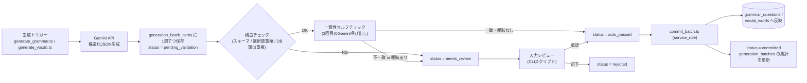

# TOEIC学習アプリ 設計ドキュメント

このファイルはプロジェクトの設計決定事項を記録する。機能追加・仕様変更のたびに追記していく運用とする。

---

## 更新履歴

- 2026-08-08: 初版作成。ディレクトリ構成・DBスキーマ（FSRS版）・ER図・RLSポリシーを確定。
- 2026-08-08: Gemini APIバッチ生成パイプライン（プロンプトテンプレート・自動検証・人力レビュー・本番反映フロー）を確定。
- 2026-08-08: フロントエンド設計（技術スタック・認証方式・ルーティング・FSRS統合方針）を確定。
- 2026-08-13: モバイル表示（390×844、iPhone 12/13相当）の確認を実施。主要9画面（Home/VocabReview/GrammarDrill/WeakPoints/VocabTagList/MixedDrill/Login/GrammarCategories/AuthCallback）を、各画面の主要な状態（未回答/回答済み、空状態/データありなど）まで含めて確認したが、崩れは1件も見つからず修正不要だった。特に懸念していた`VocabReview`の4択評価ボタン（`grid-cols-4`固定）と、`WeakPoints`の`StatRow`（ラベル+バッジを左・ゲージ+正答率+件数を右に配置する`justify-between`レイアウト、最長のカテゴリ名「不定詞・動名詞」でも確認）はいずれも折り返し・はみ出し無く収まった。単一カラム・`flex`/`gap`ベースの余白設計（固定px幅を極力使わない）が功を奏している。
- 2026-08-13: キーボード操作の完結性を見直し、GrammarDrill/MixedDrill/VocabReviewの3画面で見つかった断絶を修正。
  - **セッション完了画面でEnterキーが効かなくなっていた不具合**（3画面共通）: 各画面のグローバルkeydownハンドラは「現在の設問/カード」が`undefined`（配列範囲外）だと即returnする作りだったため、セッション完了画面（＝設問/カードが尽きた状態）ではEnterが一切反応しなくなっていた。`isSessionComplete`を明示的に判定し、その場合はEnterで主要リンクへ`navigate()`するよう修正（GrammarDrillは「カテゴリ一覧に戻る」、MixedDrillは「ホームに戻る」、VocabReviewは`backLabel`＝文脈に応じて「ホームに戻る」または「弱点分析ダッシュボードに戻る」）。各完了画面に「Enter: ◯◯に戻る」のヒント文言も追加。
  - **VocabReviewの「答えを見る」にキーボード操作が無かった不具合**: 依頼内容には無かったが、一連の流れをキーボードのみで通しで確認する過程で発見。答えを見る前はEnterキーで反応しないため、キーボードのみのユーザーがここで詰まっていた。Enterで`handleReveal()`を実行するよう追加し、下部ヒントも状態に応じて「Enter: 答えを見る」⇔「1〜4: 評価」を出し分けるようにした。評価後の自動遷移（`useMutation`の`onSuccess`で`advance()`）は既存実装のとおり正しく機能していることを確認済み（変更なし）。
  - **AskTutorPanel（もっと詳しく聞く）とのEnterキー競合**: パネルの`<textarea>`にフォーカスがある状態でEnterを押すと、改行が入るのと同時に親画面のグローバルkeydownハンドラにもイベントが伝播し、意図せず「次の問題へ」が発火してしまう不具合を確認。修正: textareaにEnter(Shiftなし)＝質問送信・Shift+Enter＝改行という専用ハンドラを追加し、パネルのルート要素（閉じたボタン状態・展開後のコンテナ双方）に`onKeyDown={(e) => e.stopPropagation()}`を付与して、パネル内でのキー入力が親のwindowリスナーに一切伝播しないようにした。調査の過程で、依頼内容を超えてもう1つの実害を発見: VocabReviewは評価ボタンが表示されている間（＝パネルも同時に表示されうる間）1〜4キーが生きているため、質問文に数字を含めて入力すると（例:「なぜ2ではダメ？」）誤って評価が送信されてしまう状態だった。stopPropagationの対象をEnterに限定せずキー入力全般にしたことで、この経路もあわせて解消した。
  - **動作確認（依頼の4番）**: ブラウザ拡張が本セッションでは接続できず、実ブラウザでのライブ確認は実施できなかった（正直に申告）。代わりに、実際のDOM keydownイベント・実際のルーター遷移を伴う自動テストで同等のキーボードのみフロー（問題を見る→回答→Enterで次へ→…→セッション完了→Enterで遷移、VocabReviewは答えを見る→評価→自動遷移→セッション完了→Enterで遷移）を新規に追加して検証した。
  - テスト: `npm test`（195件全て成功、187件から+8件——GrammarDrill/MixedDrillに各1件、VocabReviewに3件、AskTutorPanelに4件追加の計8件）・`npm run lint`（0件）・`npm run typecheck`（0件）。
- 2026-08-11: AskTutorPanelの改善2件。まず動作確認の過程で、直前のEnterキー競合修正が未コミットのままだったため`dist/`が古いビルドのままで、本番ビルド(`npm run build`)では旧不具合が再現する状態だったことが判明（デプロイ設定は無く`npm run preview`でのローカル配信のみのプロジェクトのため、再ビルドのみで解消）。その上で以下を追加実装。
  - **「もっと詳しく聞く」ボタンへのキーボードショートカット割り当て**: パネルが閉じている間だけ`"?"`キーでパネルを開けるようにし（開いた後は`useEffect`でリスナーを外し、質問文に`?`を打てるようにする）、閉じたボタンのラベル横に`?`のヒントを表示（`CHOICE_LABELS`/`RATING_KEY_HINTS`と同じ、キーヒントをボタン横に添えるパターンを踏襲）。開いた瞬間に`textarea`へ自動フォーカスする。
  - **定型質問のスニペットボタン**: テキストエリア上部に、クリックで質問文を差し込める定型文ボタンを追加（「なぜこの答えが正しいのですか?」「もっと詳しく教えてください」は常設、「他の選択肢ではなぜダメなのですか?」は`choices`が渡されている設問（GrammarDrill/MixedDrill）でのみ表示——VocabReview（選択肢の概念が無い）では出さない）。
  - **質問入力中のショートカットヒント切り替え**: `AskTutorPanel`に`onFocusChange`コールバックを追加し、テキストエリアの`onFocus`/`onBlur`で親に通知。GrammarDrill/MixedDrill/VocabReviewはこれを`isAskingTutor`状態として受け取り、画面下部のヒント文言を「1〜4: 選択 / Enter: 次へ」等から「Enter: 質問を送信 / Shift+Enter: 改行」に切り替える。状態のリセットは明示的なリセット処理を持たず、テキストエリアのフォーカスが外れる（＝ボタンクリックで次へ進む際は自然にblurする）ことに委ねている——`currentIndex`変化時に`setIsAskingTutor(false)`する案は`eslint-plugin-react-hooks`の`set-state-in-effect`に抵触するため採用しなかった。
  - テスト: `npm test`（204件全て成功、195件から+9件——AskTutorPanelに6件、GrammarDrill/MixedDrill/VocabReviewに各1件追加の計9件）・`npm run lint`（0件）・`npm run typecheck`（0件）。
- 2026-08-11: `src/routes/WeakPoints.tsx`のゲージを弧状メーターからアナログ針式デザインに刷新。Claude Designで作成した「Weakness Dashboard Gauges」1a案をベースに実装し、目盛り（minor/major 2段階）・ラベル（0/50/100の3点のみ）・針・中心の丸を追加した。
  - **検討したが不採用にした案**: 1a案が持つ3階調配色（green/amber/red、正答率に応じて段階的に色分けする案）は不採用とし、既存方針どおり2階調（correct/incorrect）の配色を踏襲した。理由はコンポーネント直上のコメントに記録済み——`StatRow`のバッジ色ロジックと一貫させ、紫（弱点分析ダッシュボードの他要素で使用）と評価色を混同させないため（20章参照、紫回避の方針自体は既存）。
  - 対象ファイルは`src/routes/WeakPoints.tsx`のみ（`src/routes/WeakPoints.test.tsx`は変更なしで全て既存のまま成功）。
  - テスト: `npm test`（WeakPoints関連8件を含め既存のまま全件成功）・`npm run lint`（0件）・`npm run typecheck`（0件）。
- 2026-08-11: AIチューターの1日あたり利用回数を30回→10回に変更し、AskTutorPanelを開いたままCtrl+Enterで次の問題に進められるようにした。
  - **利用回数上限の変更**: `supabase/functions/ask-tutor/index.ts`の`MAX_DAILY_REQUESTS`を`30`から`10`に変更。**クラウドへの再デプロイ（`supabase functions deploy ask-tutor`）は未実施**——外部APIキーが絡む操作としてCLAUDE.mdの確認事項に該当するため、コード変更のみ行いユーザーの許可待ちとした。ローカルの`supabase functions serve`を使う場合は次回起動時から反映される。
  - **Ctrl+Enter(Mac互換でCmd+Enterも)で次の問題へ**: `AskTutorPanel`の`handleTextareaKeyDown`と、ルート要素の`onKeyDown`（`handleRootKeyDown`に切り出し）の両方で、`Enter`かつ`ctrlKey`/`metaKey`のときだけ質問送信・stopPropagationの対象から除外し、親画面のグローバルkeydownハンドラ（GrammarDrill/MixedDrillの「Enterで次へ」）まで素通りさせるようにした。textarea側は`preventDefault()`のみ行い（改行が入らないようにする）送信はしない。GrammarDrill/MixedDrillの質問入力中ヒントに「Ctrl+Enter: 次へ」を追加し、テキストエリアのplaceholderにも明記した。VocabReviewは回答後の「次へ」がEnterキーではなく1〜4キーでの評価に紐づく設計（25章）のため、この変更の対象外とした。
  - テスト: `npm test`（207件全て成功、204件から+3件——AskTutorPanelに1件、GrammarDrill/MixedDrillに各1件追加の計3件）・`npm run lint`（0件）・`npm run typecheck`（0件）。`ask-tutor`はDeno Edge Function（Vitest対象外）のため定数変更のみで自動テストは無し。

---

## 1. 要件概要

- 目的: 文法・語彙強化、目標スコア900点
- 複数端末で同期（Supabase / Postgres）
- 問題データはGemini APIで事前バッチ生成しDBにストック。リアルタイム生成はしない
- MVP機能:
  1. 語彙SRS（間隔反復）
  2. 文法カテゴリ別ドリル
  3. 誤答を「文法カテゴリ×正答率」「語彙タグ×正答率」でタグ付けする弱点分析ダッシュボード
- フロントエンド: React Webアプリ（将来スマホ対応）

---

## 2. プロジェクト構成

現時点では `apps/web` 単一構成。pnpm workspacesへのモノレポ移行は、将来モバイル版（Expo/React Native）を追加するタイミングで検討する。

```
toeic-app/
├── src/
│   ├── features/
│   │   ├── auth/
│   │   ├── vocab-srs/          # ①語彙SRS（ts-fsrs連携）
│   │   ├── grammar-drill/      # ②文法ドリル
│   │   └── weak-points/        # ③弱点分析ダッシュボード
│   ├── components/
│   ├── lib/
│   │   ├── supabase.ts
│   │   └── fsrs.ts             # ts-fsrs初期化・パラメータ管理ラッパー
│   ├── hooks/
│   ├── routes/
│   └── App.tsx
├── scripts/
│   └── content-generation/     # Gemini APIバッチ生成（同一package.json内でtsx実行）
│       ├── generate_vocab.ts
│       ├── generate_grammar.ts
│       ├── prompts/
│       └── validators/
├── supabase/
│   ├── migrations/
│   ├── seed.sql                # grammar_categories初期データ
│   └── config.toml
├── index.html
├── package.json
└── vite.config.ts
```

**決定理由**: `content-generation`スクリプトはフロントと同一リポジトリだが、Gemini APIキーはこのスクリプト実行環境（CI/ローカル）にのみ持たせ、クライアントには一切露出させない。

---

## 3. SRSアルゴリズム: FSRS

- SM-2ではなくFSRS（`ts-fsrs`ライブラリ）を採用。予測精度が高く、実装コストもSM-2と大差ないため。
- **desired_retention: 0.92**（デフォルトの0.9より高め）。900点目標のため復習負荷増よりも定着率を優先する判断。
- ユーザーごとのFSRSパラメータ最適化は将来対応（`user_fsrs_parameters`テーブルを予め用意、MVPではデフォルト重みを使用）。

---

## 4. 文法カテゴリ（9分類、初期セット）

```
時制 / 態（能動・受動）/ 仮定法 / 関係詞 / 不定詞・動名詞 /
前置詞 / 接続詞 / 比較 / 品詞（語彙問題との境界整理用）
```

`grammar_categories.parent_id` で階層を持たせており、後からサブカテゴリへの細分化・カテゴリ統合が可能な設計（既存の問題・解答ログを壊さずに再カテゴライズできる）。

---

## 5. 弱点分析ダッシュボード

文法・語彙の両面が揃わないと弱点分析として片手落ちになるため、以下2軸を両方表示する。

- **文法カテゴリ別正答率**: `user_grammar_category_stats` ビュー
- **語彙タグ別正答率**: `user_vocab_tag_stats` ビュー（SRSレビューのgrade/ratingを正誤に変換して集計）

---

## 6. DBスキーマ（Supabase / Postgres）

### 6.1 プロフィール

```sql
create table profiles (
  id uuid primary key references auth.users(id) on delete cascade,
  display_name text,
  target_score int not null default 900,
  created_at timestamptz not null default now(),
  updated_at timestamptz not null default now()
);
```

### 6.2 バッチ生成管理

```sql
create type content_type as enum ('vocab', 'grammar');

create table generation_batches (
  id uuid primary key default gen_random_uuid(),
  content_type content_type not null,
  model_name text not null,
  prompt_version text not null,
  requested_count int not null,
  generated_count int not null default 0,
  status text not null default 'pending',
  notes text,
  created_at timestamptz not null default now()
);
```

### 6.3 語彙SRS（FSRS）

`ts-fsrs`の`Card`/`ReviewLog`インターフェースにフィールド名を合わせている。

```sql
create table vocab_words (
  id uuid primary key default gen_random_uuid(),
  word text not null,
  part_of_speech text,
  meaning_ja text not null,
  example_sentence_en text not null,
  example_sentence_ja text,
  toeic_band int,
  frequency_rank int,
  batch_id uuid references generation_batches(id),
  created_at timestamptz not null default now(),
  unique (word, part_of_speech)
);

create table vocab_tags (
  id serial primary key,
  name text not null unique
);

create table vocab_word_tags (
  vocab_word_id uuid references vocab_words(id) on delete cascade,
  tag_id int references vocab_tags(id) on delete cascade,
  primary key (vocab_word_id, tag_id)
);

-- FSRSカード状態（ts-fsrs: New=0, Learning=1, Review=2, Relearning=3）
create type fsrs_state as enum ('new','learning','review','relearning');

create table user_vocab_progress (
  id uuid primary key default gen_random_uuid(),
  user_id uuid not null references auth.users(id) on delete cascade,
  vocab_word_id uuid not null references vocab_words(id) on delete cascade,
  state fsrs_state not null default 'new',
  due_at timestamptz not null default now(),
  stability numeric(10,4) not null default 0,
  difficulty numeric(10,4) not null default 0,
  elapsed_days numeric(10,2) not null default 0,
  scheduled_days numeric(10,2) not null default 0,
  reps int not null default 0,
  lapses int not null default 0,
  last_review_at timestamptz,
  updated_at timestamptz not null default now(),
  unique (user_id, vocab_word_id)
);
create index idx_user_vocab_progress_due on user_vocab_progress(user_id, due_at);

-- FSRS ReviewLog相当（Rating: Again/Hard/Good/Easy）
create type fsrs_rating as enum ('again','hard','good','easy');

create table vocab_review_logs (
  id bigint generated always as identity primary key,
  user_id uuid not null references auth.users(id) on delete cascade,
  vocab_word_id uuid not null references vocab_words(id) on delete cascade,
  rating fsrs_rating not null,
  state fsrs_state not null,
  due_at timestamptz not null,
  stability numeric(10,4) not null,
  difficulty numeric(10,4) not null,
  elapsed_days numeric(10,2),
  last_elapsed_days numeric(10,2),
  scheduled_days numeric(10,2),
  response_time_ms int,
  reviewed_at timestamptz not null default now()
);
create index idx_vocab_review_logs_user_time on vocab_review_logs(user_id, reviewed_at);

-- ユーザー個別のFSRSパラメータ（将来: 十分なレビュー数が貯まったユーザーから最適化）
create table user_fsrs_parameters (
  user_id uuid primary key references auth.users(id) on delete cascade,
  weights jsonb not null,
  desired_retention numeric(4,3) not null default 0.92,
  optimized_at timestamptz,
  updated_at timestamptz not null default now()
);
```

### 6.4 文法ドリル（階層対応）

```sql
create type toeic_part as enum ('part5','part6','part7','listening','general');

create table grammar_categories (
  id serial primary key,
  code text not null unique,
  name_ja text not null,
  parent_id int references grammar_categories(id),
  part toeic_part not null default 'part5',
  sort_order int not null default 0
);

create table grammar_questions (
  id uuid primary key default gen_random_uuid(),
  category_id int not null references grammar_categories(id),
  question_text text not null,
  choices jsonb not null,
  correct_index smallint not null,
  explanation text,
  difficulty smallint not null default 3,
  batch_id uuid references generation_batches(id),
  created_at timestamptz not null default now()
);
create index idx_grammar_questions_category on grammar_questions(category_id);

create table user_grammar_attempts (
  id bigint generated always as identity primary key,
  user_id uuid not null references auth.users(id) on delete cascade,
  question_id uuid not null references grammar_questions(id) on delete cascade,
  selected_index smallint not null,
  is_correct boolean not null,
  response_time_ms int,
  answered_at timestamptz not null default now()
);
create index idx_user_grammar_attempts_user_time on user_grammar_attempts(user_id, answered_at);
create index idx_user_grammar_attempts_question on user_grammar_attempts(question_id);
```

**初期シードデータ**

```sql
insert into grammar_categories (code, name_ja, sort_order) values
  ('tense',              '時制',              1),
  ('voice',              '態（能動・受動）',   2),
  ('subjunctive',        '仮定法',            3),
  ('relative_clause',    '関係詞',            4),
  ('infinitive_gerund',  '不定詞・動名詞',     5),
  ('preposition',        '前置詞',            6),
  ('conjunction',        '接続詞',            7),
  ('comparison',         '比較',              8),
  ('part_of_speech',     '品詞',              9);
```

### 6.5 弱点分析ビュー（文法 + 語彙）

```sql
-- 文法カテゴリ別正答率
create view user_grammar_category_stats as
select
  a.user_id,
  q.category_id,
  c.name_ja as category_name,
  c.parent_id,
  count(*) as total_attempts,
  count(*) filter (where a.is_correct) as correct_attempts,
  round(count(*) filter (where a.is_correct)::numeric / count(*), 3) as accuracy_rate,
  max(a.answered_at) as last_attempted_at
from user_grammar_attempts a
join grammar_questions q on q.id = a.question_id
join grammar_categories c on c.id = q.category_id
group by a.user_id, q.category_id, c.name_ja, c.parent_id;

-- 語彙タグ別正答率
-- rating in ('good','easy') を正答、('again','hard') を誤答とみなして集計
create view user_vocab_tag_stats as
select
  l.user_id,
  t.id as tag_id,
  t.name as tag_name,
  count(*) as total_reviews,
  count(*) filter (where l.rating in ('good', 'easy')) as correct_reviews,
  round(
    count(*) filter (where l.rating in ('good', 'easy'))::numeric / count(*),
    3
  ) as accuracy_rate,
  max(l.reviewed_at) as last_reviewed_at
from vocab_review_logs l
join vocab_word_tags wt on wt.vocab_word_id = l.vocab_word_id
join vocab_tags t on t.id = wt.tag_id
group by l.user_id, t.id, t.name;
```

`parent_id`を含めているため、将来サブカテゴリを追加しても親カテゴリ単位のロールアップ集計（再帰CTE）に対応できる。

---

## 7. RLS（Row Level Security）ポリシー

### 方針

- ユーザー個人データ（`profiles`, `user_vocab_progress`, `vocab_review_logs`, `user_fsrs_parameters`, `user_grammar_attempts`）→ 本人（`auth.uid()`）のみ読み書き可
- コンテンツデータ（`vocab_words`, `vocab_tags`, `vocab_word_tags`, `grammar_categories`, `grammar_questions`, `generation_batches`）→ 認証済みユーザーはSELECTのみ。INSERT/UPDATE/DELETEはservice_role（バッチ生成スクリプト）のみ

### SQL

```sql
-- 全対象テーブルでRLSを有効化
alter table profiles enable row level security;
alter table user_vocab_progress enable row level security;
alter table vocab_review_logs enable row level security;
alter table user_fsrs_parameters enable row level security;
alter table user_grammar_attempts enable row level security;
alter table vocab_words enable row level security;
alter table vocab_tags enable row level security;
alter table vocab_word_tags enable row level security;
alter table grammar_categories enable row level security;
alter table grammar_questions enable row level security;
alter table generation_batches enable row level security;

-- ── ユーザー個人データ: 本人のみ読み書き可 ──────────────────

create policy "profiles_select_own" on profiles
  for select using (auth.uid() = id);
create policy "profiles_insert_own" on profiles
  for insert with check (auth.uid() = id);
create policy "profiles_update_own" on profiles
  for update using (auth.uid() = id) with check (auth.uid() = id);

create policy "user_vocab_progress_select_own" on user_vocab_progress
  for select using (auth.uid() = user_id);
create policy "user_vocab_progress_insert_own" on user_vocab_progress
  for insert with check (auth.uid() = user_id);
create policy "user_vocab_progress_update_own" on user_vocab_progress
  for update using (auth.uid() = user_id) with check (auth.uid() = user_id);
create policy "user_vocab_progress_delete_own" on user_vocab_progress
  for delete using (auth.uid() = user_id);

create policy "vocab_review_logs_select_own" on vocab_review_logs
  for select using (auth.uid() = user_id);
create policy "vocab_review_logs_insert_own" on vocab_review_logs
  for insert with check (auth.uid() = user_id);
-- レビュー履歴は追記のみ。update/deleteポリシーは意図的に作成しない。

create policy "user_fsrs_parameters_select_own" on user_fsrs_parameters
  for select using (auth.uid() = user_id);
create policy "user_fsrs_parameters_insert_own" on user_fsrs_parameters
  for insert with check (auth.uid() = user_id);
create policy "user_fsrs_parameters_update_own" on user_fsrs_parameters
  for update using (auth.uid() = user_id) with check (auth.uid() = user_id);

create policy "user_grammar_attempts_select_own" on user_grammar_attempts
  for select using (auth.uid() = user_id);
create policy "user_grammar_attempts_insert_own" on user_grammar_attempts
  for insert with check (auth.uid() = user_id);
-- 解答履歴も追記のみ。update/deleteポリシーは意図的に作成しない。

-- ── コンテンツデータ: 認証済みユーザーはSELECTのみ ────────────
-- INSERT/UPDATE/DELETEポリシーは作成しない
-- （service_roleはRLSをバイパスするため、バッチ生成スクリプトはservice_roleキーで書き込む）

create policy "vocab_words_select_authenticated" on vocab_words
  for select using (auth.role() = 'authenticated');

create policy "vocab_tags_select_authenticated" on vocab_tags
  for select using (auth.role() = 'authenticated');

create policy "vocab_word_tags_select_authenticated" on vocab_word_tags
  for select using (auth.role() = 'authenticated');

create policy "grammar_categories_select_authenticated" on grammar_categories
  for select using (auth.role() = 'authenticated');

create policy "grammar_questions_select_authenticated" on grammar_questions
  for select using (auth.role() = 'authenticated');

-- generation_batchesはユーザーに見せる必要がないため、authenticatedへのSELECTも許可しない
-- （service_roleのみがアクセス。ポリシーを作らない = デフォルト拒否）
```

**補足**:
- `generation_batches`はSELECTポリシーを一切作らないことで、authenticatedロールからは完全に見えない状態にする（管理用データのため）。
- ビュー（`user_grammar_category_stats`, `user_vocab_tag_stats`）はベーステーブルのRLSを継承するため、追加のポリシーは不要（Postgresのview RLS挙動により、実行ユーザーの権限で元テーブルのポリシーが評価される）。

---

## 8. Gemini APIバッチ生成パイプライン

「生成 → 自動チェック → 必要なら人力レビュー → 本番反映」の4段階フローとする。`generation_batches`には集計情報のみ記録し、生成された問題そのもの（生JSON・検証結果）は新設の `generation_batch_items` にステージングする。`grammar_questions` / `vocab_words` への反映（コミット）は、承認済みアイテムのみを対象にservice_role経由で行う。

### 8.1 全体フロー



**設計判断**: 自動チェックを通過したアイテム（`auto_passed`）も人力レビューを経ずに直接コミット対象にする。理由は、文法問題は「一意性セルフチェック」で二重に正解を検証しているため誤り率が十分低いと見込めること、900点対策では出題量の確保も重要なため全問人力レビューはボトルネックになること。品質に懸念が出た場合は`auto_passed`も一律`needs_review`に回す運用に切り替えられるよう、判定ロジックは1箇所（`validate_batch.ts`）に集約する。

### 8.2 スキーマ拡張

```sql
-- generation_batches のステータスを厳密化 + 集計カラム追加
create type batch_status as enum (
  'pending', 'generating', 'validating', 'needs_review', 'completed', 'failed'
);

alter table generation_batches
  alter column status type batch_status using status::batch_status,
  alter column status set default 'pending',
  add column committed_count int not null default 0,
  add column needs_review_count int not null default 0,
  add column rejected_count int not null default 0;

-- 生成された1問ごとのステージングテーブル
create type item_status as enum (
  'pending_validation',
  'auto_passed',
  'needs_review',
  'approved',
  'rejected',
  'committed'
);

create table generation_batch_items (
  id uuid primary key default gen_random_uuid(),
  batch_id uuid not null references generation_batches(id) on delete cascade,
  raw_payload jsonb not null,              -- Geminiが返した生JSON(1問分)
  status item_status not null default 'pending_validation',
  validation_errors jsonb,                 -- 構造チェックで検出した問題点
  self_check_payload jsonb,                -- 一意性セルフチェック(2回目のLLM呼び出し)の結果
  reviewed_by uuid references auth.users(id),
  reviewed_at timestamptz,
  review_notes text,
  committed_id uuid,                       -- 反映先(grammar_questions.id / vocab_words.id)
  created_at timestamptz not null default now()
);
create index idx_generation_batch_items_batch on generation_batch_items(batch_id);
create index idx_generation_batch_items_status on generation_batch_items(status);

-- 近似重複検出用（DB内の既存問題・単語との類似度チェックに使用）
create extension if not exists pg_trgm;
create index idx_grammar_questions_text_trgm on grammar_questions using gin (question_text gin_trgm_ops);
create index idx_vocab_words_word_trgm on vocab_words using gin (word gin_trgm_ops);
```

**RLS**: `generation_batch_items`は管理用データのため、SELECTポリシーを含め一切ポリシーを作成しない（デフォルト拒否）。既存の`generation_batches`同様、service_roleのみがアクセスする。

```sql
alter table generation_batch_items enable row level security;
-- ポリシーを作成しない = authenticated/anonからは完全に不可視
```

### 8.3 プロンプトテンプレート

`scripts/content-generation/prompts/`配下にカテゴリ横断の共通テンプレートを1つずつ持ち、呼び出し時にプレースホルダーを埋め込む。テンプレート自体の改訂は`prompt_version`（例: `grammar_v1.1`）でトラッキングする。

#### 文法問題（`prompts/grammar.md`）

対象カテゴリは9分類（時制／態／仮定法／関係詞／不定詞・動名詞／前置詞／接続詞／比較／品詞）を`{{category_code}}` / `{{category_name_ja}}`として注入する。

```
あなたはTOEIC L&R対策教材の作成者です。
以下の条件でPart5（短文穴埋め）形式の文法問題を{{count}}問作成してください。

【出題カテゴリ】
{{category_name_ja}}（{{category_code}}）
※このカテゴリの文法知識のみが正解の決め手になるようにしてください。
　他の文法事項が同時に論点になる問題は避けてください。

【難易度】
5段階中 {{difficulty}}（1=易しい、5=難しい。TOEIC {{target_band}}点レベル目安）

【出題条件】
- ビジネスシーンを想定した自然な英文にする
- 空所は1箇所、選択肢は4つ、正解は必ず1つのみ
- 4つの選択肢は互いに異なる語句にする
- 正解以外の3択は文法的に明確に誤りであること（意味は通るが文法的に誤り、
  品詞違い、時制違いなど）。文脈次第で正解になり得る選択肢を含めない
- 文脈情報（時を表す副詞句など）を十分に与え、正解が一意に定まるようにする

【重複回避】
以下は既に出題済みの問題文サンプルです。構文・論点が類似する問題は作らないでください。
{{existing_question_samples}}

【出力形式】
説明文は一切付けず、以下のJSON Schemaに厳密に従うJSON配列のみを出力してください。
{{json_schema}}

explanationには、なぜ正解が正しく他の3択がそれぞれ何故誤りかを日本語で簡潔に記述してください。
```

出力JSON Schema（Gemini `responseSchema`にそのまま渡す）:

```json
{
  "type": "ARRAY",
  "items": {
    "type": "OBJECT",
    "properties": {
      "question_text":  { "type": "STRING" },
      "choices":        { "type": "ARRAY", "items": { "type": "STRING" }, "minItems": 4, "maxItems": 4 },
      "correct_index":  { "type": "INTEGER" },
      "explanation":    { "type": "STRING" },
      "difficulty":     { "type": "INTEGER" },
      "category_code":  { "type": "STRING" }
    },
    "required": ["question_text", "choices", "correct_index", "explanation", "difficulty", "category_code"],
    "propertyOrdering": ["question_text", "choices", "correct_index", "explanation", "difficulty", "category_code"]
  }
}
```

#### 語彙（`prompts/vocab.md`）

対象タグ（例: ビジネス／日常会話／Part7頻出）を`{{tag_name}}`として注入する。

```
あなたはTOEIC L&R対策教材の作成者です。
以下の条件で語彙学習用のカード情報を{{count}}件作成してください。

【テーマ】
{{tag_name}}

【難易度】
TOEIC {{target_band}}点レベルの頻出語彙を中心に選定してください。

【出力条件】
- 見出し語（word）は原形（動詞は原形、名詞は単数形）を基本とする
- meaning_jaは文脈に応じた最も一般的な訳語を1〜2個
- example_sentence_enはビジネスシーンを想定した自然な例文とし、
  必ずwordを文中でpart_of_speechの品詞として使用すること
- example_sentence_jaはexample_sentence_enの自然な日本語訳

【重複回避】
以下は登録済みの単語です。同一語は生成しないでください。
{{existing_words}}

【出力形式】
説明文は一切付けず、以下のJSON Schemaに厳密に従うJSON配列のみを出力してください。
{{json_schema}}
```

出力JSON Schema:

```json
{
  "type": "ARRAY",
  "items": {
    "type": "OBJECT",
    "properties": {
      "word":                 { "type": "STRING" },
      "part_of_speech":       { "type": "STRING" },
      "meaning_ja":           { "type": "STRING" },
      "example_sentence_en":  { "type": "STRING" },
      "example_sentence_ja":  { "type": "STRING" },
      "toeic_band":           { "type": "INTEGER" },
      "tags":                 { "type": "ARRAY", "items": { "type": "STRING" } }
    },
    "required": ["word", "part_of_speech", "meaning_ja", "example_sentence_en", "example_sentence_ja", "toeic_band", "tags"],
    "propertyOrdering": ["word", "part_of_speech", "meaning_ja", "example_sentence_en", "example_sentence_ja", "toeic_band", "tags"]
  }
}
```

`{{existing_question_samples}}` / `{{existing_words}}`はDB上の同一カテゴリ・同一タグの直近N件（目安30件）を取得して埋め込む。プロンプト内の除外リストだけでは件数が増えるほど機能しなくなるため、8.4の近似重複検出をセーフティネットとして必ず併用する。

### 8.4 自動検証（バリデーション）

`generate_*.ts`が各アイテムを`generation_batch_items`に保存した直後、`validate_batch.ts`が以下を順に実行する。

**① 構造チェック（LLM呼び出しなし）**
- Zod等でJSON構造・型を再検証（Gemini側のresponseSchemaは強制力が弱いケースがあるため二重チェック）
- 文法問題: `choices`が4件・正規化（trim・大小文字統一）後も重複なし、`correct_index`が0〜3の範囲内、`explanation`が空でない
- 語彙: `word` + `part_of_speech`の組み合わせがDB内で未使用（`vocab_words`のunique制約と同条件を事前チェック）

**② 近似重複検出（DBクエリ、LLM呼び出しなし）**
```sql
-- 文法問題の例（vocab_wordsも同様にsimilarity検索）
select id, question_text, similarity(question_text, $1) as sim
from grammar_questions
where question_text % $1
order by sim desc
limit 5;
```
類似度が閾値（目安0.6）を超えるものが見つかった場合は`validation_errors`に記録し、`needs_review`に振り分ける。

**③ 一意性セルフチェック（2回目のGemini呼び出し）**
文法問題のみ対象。生成時とは独立に、正解を伏せた状態で同じ問題をGeminiに解かせ、自己採点との整合性を確認する。

```
以下の英文の空所に入る最も適切な語句を1つ選び、他の選択肢がなぜ不適切かも判定してください。

{{question_text}}
選択肢: {{choices}}

複数の選択肢が文法的・意味的に成立し得る場合は is_ambiguous を true にしてください。
```

出力JSON Schema:
```json
{
  "type": "OBJECT",
  "properties": {
    "solved_index":     { "type": "INTEGER" },
    "is_ambiguous":      { "type": "BOOLEAN" },
    "ambiguity_reason":  { "type": "STRING" },
    "confidence":        { "type": "NUMBER" }
  },
  "required": ["solved_index", "is_ambiguous", "confidence"]
}
```
判定ロジック: `solved_index === correct_index` かつ `is_ambiguous === false` かつ `confidence >= 0.8` → `auto_passed`。いずれか外れれば`needs_review`（`self_check_payload`に結果を保存し、レビュー時に参照）。

語彙は選択式問題ではないため一意性セルフチェックの対象外とし、代わりに①②のみで`auto_passed`とする（意味の正確性は人力レビューのサンプリングチェックに委ねる）。

### 8.5 人力レビュー

`needs_review`のアイテムのみが対象。専用UIは作らず、まずは軽量なCLIスクリプト（`review_batch.ts`）で運用する。

- `generation_batch_items`から`status = 'needs_review'`を一覧表示（`raw_payload` / `validation_errors` / `self_check_payload`を並べて表示）
- レビュー者が承認（`approved`）／却下（`rejected`）／その場で内容修正して承認、のいずれかを選択
- `reviewed_by`（`auth.uid()`相当の管理者ID）・`reviewed_at`・`review_notes`を記録

将来レビュー量が増えた場合は、`weak-points`ダッシュボードと同じReact基盤上に簡易レビュー画面を追加する想定（現時点ではCLIで十分）。

### 8.6 本番反映（コミット）

`commit_batch.ts`をservice_roleキーで実行し、`status in ('auto_passed', 'approved')`のアイテムのみを対象に処理する。

1. 文法問題: `category_code`から`grammar_categories.id`を解決し、`grammar_questions`にINSERT（`batch_id`を保持）
2. 語彙: `vocab_words`にINSERT（unique制約でレース時の重複はDB側で防止）。`tags`配列は`vocab_tags`を`upsert`し`vocab_word_tags`に紐付け
3. 成功したアイテムは`generation_batch_items.status = 'committed'`、`committed_id`に反映先IDを記録
4. `generation_batches`の`committed_count` / `needs_review_count` / `rejected_count`を更新し、全アイテムが`committed`または`rejected`になった時点で`status = 'completed'`に更新

クライアント（Reactアプリ）はこのフローに一切関与せず、`grammar_questions` / `vocab_words`への書き込み権限も持たない（7章のRLS方針どおり）。

---

## 9. フロントエンド設計

### 9.1 技術スタック

| 領域 | 選定 | 理由 |
|---|---|---|
| ビルド | Vite + React + TypeScript | 標準的で立ち上げが速い |
| ルーティング | React Router v7（data router） | 実績・ドキュメントが豊富。loaderでの認証ガードがシンプルに書ける。TanStack Routerの型安全性は魅力だが、MVPの規模では学習コスト対効果が見合わないため見送り |
| サーバー状態 | TanStack Query（React Query）+ `supabase-js` | Supabaseクエリを非同期関数としてラップし、キャッシュ・再検証・楽観的更新を統一的に扱える。複数端末同期の「他端末での更新をこの端末にも反映する」導線として`refetchOnWindowFocus`を活用 |
| ローカルUI状態 | Zustand | ドリルセッションの進行状態・モーダル開閉など、サーバー状態と分離すべき一時的な状態のみに限定して使用。Reduxほどの構成は不要 |
| スタイリング | Tailwind CSS | 弱点分析ダッシュボードのような数値・色分け表現をユーティリティクラスで素早く組める |
| フォーム | 素のcontrolled component | MVPの入力（解答選択・設定画面）は単純なため、react-hook-form等の導入は見送り |

### 9.2 認証

- Supabase Authを利用し、**メール+パスワード**と**Googleログイン（OAuth）**の2方式を提供する
  - メール+パスワード: オフラインでも迷わない基本手段として必須
  - Google OAuth: 導入コストが低く、初回登録の離脱率を下げるため追加
  - マジックリンクは将来検討（MVPでは見送り）
- セッションは`supabase-js`のデフォルト永続化（localStorage + 自動リフレッシュ）に任せる
- 複数タブ・複数端末間のログイン状態同期は`supabase.auth.onAuthStateChange`の購読で対応（トークン失効時に自動で`/login`へ）

### 9.3 ルーティング構成

```
/                       ダッシュボード（今日のSRS件数・直近正答率サマリ）
/login                  ログイン（メール+パスワード / Googleログイン）
/vocab/review           語彙SRSレビューセッション
/grammar                文法カテゴリ一覧（9カテゴリ）
/grammar/:categoryCode  カテゴリ別ドリル実行
/weak-points            弱点分析ダッシュボード（文法×語彙）
/settings               プロフィール設定（target_score等）
```

認証ガードはRouterの`loader`内でSupabaseセッションを確認し、未ログイン時は`/login`にリダイレクトする方式に統一する（コンポーネント側で毎回チェックしない）。

### 9.4 データフェッチ層の設計方針

- Supabaseクエリは`src/lib/queries/*.ts`に集約する（例: `getDueVocabCards(userId)`、`getGrammarQuestionsByCategory(categoryCode, count)`、`getWeakPointStats(userId)`）。コンポーネントから直接`supabase.from(...)`を呼ばない
- React Queryの`queryKey`規約を統一する（例: `['vocab-due', userId]`、`['grammar-stats', userId]`、`['vocab-tag-stats', userId]`）
- ミューテーション（SRSレビュー記録・文法解答記録）はSupabaseへのINSERT/UPSERT後、関連する`queryKey`を`invalidateQueries`する
- クライアントから直接書き込むテーブルは7章のRLS方針で許可された4つのみ（`user_vocab_progress`, `vocab_review_logs`, `user_grammar_attempts`, `user_fsrs_parameters`）。それ以外（`grammar_questions`等）への書き込みコードはそもそも作らない

### 9.5 FSRS統合（クライアント側）

- `ts-fsrs`はサーバーを介さずブラウザ内で直接実行する。復習後の次回due計算をクライアントで行い、結果を`user_vocab_progress`にUPSERT、`vocab_review_logs`にINSERTする
- 計算ロジックは`src/lib/fsrs.ts`に集約し、`computeNextState(currentCard, rating) => { state, stability, difficulty, due_at, ... }`という副作用のない純粋関数として実装する（単体テストしやすくするため）
- **複数端末での競合**: 同一カードをほぼ同時に2端末でレビューするケースは稀かつ実害が小さいため、楽観ロックは実装せず「後勝ち（last-write-wins）」で割り切る

### 9.6 弱点分析ダッシュボードのUI方針

- 「文法カテゴリ別正答率」「語彙タグ別正答率」の2セクションを並べて表示する（5章の方針どおり両軸を必ず表示）
- 正答率が低い項目を強調表示する（目安: 70%未満を警告色）
- 各カテゴリ／タグのカードから該当のドリル・SRSレビューへ直接遷移できる導線を設け、「弱点の可視化→即復習」の動線を短くする

### 9.7 将来のモバイル対応に向けた配慮

- `lib/queries/*.ts`・`lib/fsrs.ts`はReactに依存しない純粋なTypeScriptとして実装し、UIコンポーネントから分離する（React Native移行時に再利用する想定）
- `lib/supabase.ts`は環境変数経由の設定のみに依存させ、Web/モバイルでクライアント初期化コードを差し替えやすくする

---

## 10. 未決事項 / 次のステップ

- レビューCLI（`review_batch.ts`）の具体的なUX（承認・却下・その場編集のコマンド設計）
- 一意性セルフチェックの`confidence`閾値・類似度閾値（0.6, 0.8）の妥当性検証（実データで調整予定）
- Gemini API失敗時のリトライ戦略
- ドリルセッションの出題順（弱点カテゴリを優先出題するか、ランダムか）のロジック
- 弱点ダッシュボードの「警告色」閾値（70%）の妥当性は実データで調整


